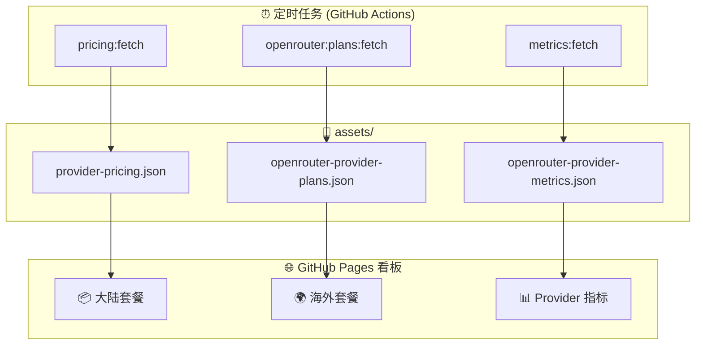

# 编码套餐 for Copilot

**一键切换多厂商 AI 模型，打破 Copilot 套餐限制。**

支持智谱、Kimi、讯飞、火山引擎、MiniMax、百度千帆、腾讯云、京东云、快手 KAT、X-AIO、Compshare、阿里云、小米 MiMo、DeepSeek 等国产大厂，以及**任何**遵循 OpenAI Chat、OpenAI Responses 或 Anthropic 协议风格的供应商。无需改变使用习惯，直接在 VS Code Copilot Chat 中调用。

---

## 核心特性

- **多协议统一接入**：支持 OpenAI Chat（`/chat/completions`）、OpenAI Responses（`/responses`）、Anthropic（`/messages`）三种协议风格，适配任意兼容供应商。
- **Anthropic 协议优先**：内置供应商默认使用 Anthropic 风格端点（`/messages`）。
- **零学习成本**：完全集成到 VS Code Copilot Chat，不改变任何操作习惯。
- **灵活模型管理**：支持动态拉取 `/models` 端点，也可自定义模型列表。
- **智能 Commit 生成**：基于 Git 变更自动生成符合 Conventional Commits 规范的提交消息。
- **编码套餐看板**：访问 [GitHub Pages 看板](https://jqknono.github.io/coding-plans-for-copilot/) 查看多家编码套餐月费与权益，以及 OpenRouter 供应商性能指标。看板每日自动更新，支持多维度筛选与 URL 状态同步。
- **密钥安全**：API Key 使用 VS Code Secret Storage 本地保存，不上云不共享。

---

## 快速开始

### 安装

**推荐方式**：在 VS Code 扩展市场搜索「编码套餐」或 `Coding Plans for Copilot` 直接安装。

#### 方式一：VS Code 内安装（推荐）

1. 打开 VS Code
2. 按 `Ctrl+Shift+X` 打开扩展面板
3. 在搜索框中输入 `Coding Plans for Copilot` 或 `编码套餐`
4. 点击 **Install** 安装
5. 安装完成后，按 `Ctrl+Shift+P` 输入 `编码套餐` 即可看到相关命令

#### 方式二：命令行安装

```bash
code --install-extension techfetch-dev.coding-plans-for-copilot
```

#### 方式三：从市场页面安装

👉 [VS Code 扩展市场直达链接](https://marketplace.visualstudio.com/items?itemName=techfetch-dev.coding-plans-for-copilot)

点击市场页面上的 **Install** 按钮，会自动在 VS Code 中打开扩展并安装。

> **前置条件**：需要 VS Code ≥ 1.120.0，且已安装 [GitHub Copilot](https://marketplace.visualstudio.com/items?itemName=GitHub.copilot) 扩展。

### 配置

1. 按 `Ctrl+Shift+P`，输入 `Coding Plans: Manage Vendor Configuration`
2. 在供应商选项框中选择你已注册的平台（如智谱、Kimi、火山引擎等）
3. 选择「Set API Key」，粘贴你的 API Key；扩展会保存密钥并刷新模型
4. 打开 Copilot Chat（`Ctrl+L`），在模型选择器中选择 `Coding Plans` 提供的模型
5. 如需设置 `topP`，在 `coding-plans.vendors[].models[]` 中配置模型级覆盖项；`temperature` 与 `Thinking Effort` 请在模型行 `More Actions` 中按请求设置；Responses API 模型会在 `More Actions` 中显示 `Personality`，并通过 `instructions` 生效
也可以直接编辑 `settings.json`，插件会打开设置页并定位到 `coding-plans.vendors`。

### 内置供应商端点

以下供应商已内置默认配置，安装后即可使用：

| 供应商 | 默认端点（内置） | 其他端点 |
| --- | --- | --- |
| 智谱（zhipu） | `https://open.bigmodel.cn/api/coding/paas/v4` | `https://open.bigmodel.cn/api/anthropic`（Claude Code） / `https://open.bigmodel.cn/api/paas/v4`（通用） |
| z.ai | `https://api.z.ai/api/anthropic` | `https://api.z.ai/api/coding/paas/v4` |
| 火山引擎 | `https://ark.cn-beijing.volces.com/api/coding` | `https://ark.cn-beijing.volces.com/api/coding/v3` |
| Volcengine Overseas | `https://ark.ap-southeast.bytepluses.com/api/coding` | `https://ark.ap-southeast.bytepluses.com/api/coding/v3` |
| Kimi | `https://api.kimi.com/coding/v1` | `https://api.kimi.com/coding/v1` |
| 阿里云（Aliyun） | `https://token-plan.cn-beijing.maas.aliyuncs.com/apps/anthropic` | `https://token-plan.cn-beijing.maas.aliyuncs.com/compatible-mode/v1` |
| 腾讯云 | `https://api.lkeap.cloud.tencent.com/plan/anthropic` | `https://api.lkeap.cloud.tencent.com/plan/v3` |
| 小米 MiMo | `https://token-plan-cn.xiaomimimo.com/anthropic` | `https://token-plan-cn.xiaomimimo.com/v1` |
| DeepSeek | `https://api.deepseek.com/anthropic` | `https://api.deepseek.com/v1` |
| OpenRouter | `https://openrouter.ai/api` | `https://openrouter.ai/api/v1` |


### 配置示例

**Anthropic 风格示例**

```json
{
  "coding-plans.vendors": [
    {
      "name": "my-anthropic-vendor",
      "baseUrl": "https://api.example.com/anthropic",
      "defaultApiStyle": "anthropic",
      "useModelsEndpoint": false,
      "models": [
        {
          "name": "my-model",
          "enabled": true,
          "capabilities": { "tools": true, "vision": false },
          "contextSize": 128000
        }
      ]
    }
  ]
}
```

**OpenAI Chat 风格**

```json
{
  "coding-plans.vendors": [
    {
      "name": "my-openai-vendor",
      "baseUrl": "https://api.example.com/v1",
      "defaultApiStyle": "openai-chat",
      "useModelsEndpoint": true,
      "models": []
    }
  ]
}
```

**OpenAI Responses 风格**

```json
{
  "coding-plans.vendors": [
    {
      "name": "openai-responses-demo",
      "baseUrl": "https://api.openai.com/v1",
      "defaultApiStyle": "openai-responses",
      "useModelsEndpoint": false,
      "models": [
        {
          "name": "gpt-5",
          "enabled": true,
          "capabilities": { "tools": true, "vision": false },
          "contextSize": 400000
        }
      ]
    }
  ]
}
```

### 可配置项

| 配置键 | 类型 | 默认值 | 说明 |
| --- | --- | --- | --- |
| `coding-plans.logLevel` | `string` | `info` | 日志级别：`debug` / `info` / `warn` / `error`。 |
| `coding-plans.vendors` | `array` | 内置供应商模板 | 供应商配置列表。 |
| `coding-plans.vendors[].name` | `string` | 必填 | 供应商唯一名称。 |
| `coding-plans.vendors[].baseUrl` | `string` | 必填 | API 基础地址。 |
| `coding-plans.vendors[].usageUrl` | `string` | 空 | 套餐 usage 接口地址，配置后状态栏显示额度百分比。 |
| `coding-plans.vendors[].defaultApiStyle` | `string` | `openai-chat` | 协议风格：`openai-chat` / `openai-responses` / `anthropic`。 |
| `coding-plans.vendors[].defaultTemperature` | `number` / `null` | 空 | 已废弃。供应商默认 temperature；留空或 `null` 时运行时不发送 `temperature`。仅 `openai-chat` 与 `anthropic` 运行时使用该值。 |
| `coding-plans.vendors[].defaultTopP` | `number` | `0` | 供应商默认 topP；`0` 表示不发送 `top_p`。`anthropic` 风格请求始终忽略该值，不发送 `top_p`。 |
| `coding-plans.vendors[].useModelsEndpoint` | `boolean` | `false` | 是否从 `/models` 拉取模型列表。 |
| `coding-plans.vendors[].models[].name` | `string` | 必填 | 模型名称。 |
| `coding-plans.vendors[].models[].enabled` | `boolean` | `true` | 是否在 Manage Language Models 中显示该模型；设为 `false` 时保留配置但隐藏。 |
| `coding-plans.vendors[].models[].description` | `string` | 空 | 模型描述。 |
| `coding-plans.vendors[].models[].apiStyle` | `string` | 继承供应商 | 模型级协议风格覆盖。 |
| `coding-plans.vendors[].models[].temperature` | `number` / `"inherit"` | `"inherit"` | 已废弃。模型级 temperature 覆盖；`"inherit"` 表示使用供应商 `defaultTemperature`。仅 `openai-chat` 与 `anthropic` 运行时使用该值。Responses API 模型行请使用 `Personality`。 |
| `coding-plans.vendors[].models[].topP` | `number` | 继承供应商 | 模型级 topP 覆盖；`0` 表示不发送 `top_p`。`anthropic` 风格请求始终忽略该值，不发送 `top_p`。 |
| `coding-plans.vendors[].models[].capabilities` | `object` | `{ tools: true, vision: false }` | 模型能力声明。 |
| `coding-plans.vendors[].models[].contextSize` | `number` | `400000` | 模型总上下文窗口；未配置时默认 400k，运行时会基于它推导输入/输出预算。 |
| `coding-plans.advanced.defaultReservedOutput` | `number` | `60000` | 请求侧默认输出 token 预算；仅作为发送请求时的预算覆盖值，最终仍会按模型输出上限收敛。 |
| `coding-plans.commitMessage.showGenerateCommand` | `boolean` | `true` | 是否显示"生成 Commit 消息"命令。 |
| `coding-plans.commitMessage.language` | `string` | `en` | 提交消息语言：`en` / `zh-cn`。 |
| `coding-plans.commitMessage.useRecentCommitStyle` | `boolean` | `false` | 是否参考最近 20 条 commit 风格。 |
| `coding-plans.commitMessage.modelVendor` | `string` | 空 | 生成提交消息时优先使用的供应商名。 |
| `coding-plans.commitMessage.modelId` | `string` | 空 | 生成提交消息时优先使用的模型名。 |
| `coding-plans.commitMessage.options.prompt` | `string` | 内置提示词 | 覆盖生成提示词。 |
| `coding-plans.commitMessage.options.maxDiffLines` | `number` | `3000` | 读取 diff 的最大行数。 |
| `coding-plans.commitMessage.options.pipelineMode` | `string` | `single` | 生成管线：`single` / `two-stage` / `auto`。 |
| `coding-plans.commitMessage.options.maxBodyBulletCount` | `number` | `7` | 正文 bullet 最大数量。 |
| `coding-plans.commitMessage.options.subjectMaxLength` | `number` | `72` | 标题最大长度。 |
| `coding-plans.commitMessage.options.requireConventionalType` | `boolean` | `true` | 是否强制 Conventional Commits 类型。 |
| `coding-plans.commitMessage.options.warnOnValidationFailure` | `boolean` | `true` | 校验失败时是否提示告警。 |

API Key 统一通过「设置 API Key」写入 VS Code Secret Storage，不再支持在 `coding-plans.vendors` 中配置。

### 上下文窗口展示

受限于 VS Code 公开 API，本扩展额外实现了上下文窗口展示：

- **System Instructions**：System 类提示词占用（系统提示、模式说明、策略提示等），属于 prompt tokens。
- **Tool Definitions**：工具定义占用（工具名、描述、参数 JSON Schema），属于 prompt tokens。
- **Reserved Output**：为本轮回答预留的输出 token 预算，非已生成的回复内容。
- **Context Window**：分母优先使用模型配置中的 `contextSize`。当前公开 API 不提供将上游 usage 明细分发回原生 Context Window 的接口，因此本扩展自行维护上下文窗口的分子展示。
- 状态栏显示统一的 `CodingPlans` 条目：正文以简洁百分比展示套餐 usage 与 context 占比，悬浮查看详细信息。
- 若供应商配置了 `usageUrl`，会额外展示套餐额度百分比。

## 高级功能

### 智能 Commit 消息生成

1. 按 `Ctrl+Shift+P`，输入 `Coding Plans: Generate Commit Message`
2. 插件会分析当前 Git 变更，自动生成符合规范的提交消息
3. 可选择使用的模型（默认使用当前配置的供应商）

### 多工作区独立配置

供应商配置可按工作区/文件夹保存；API Key 按供应商名保存在 VS Code Secret Storage（本地）。

## 📊 GitHub Pages 看板

<div align="center">

### [🚀 在线访问看板 →](https://jqknono.github.io/coding-plans-for-copilot/)

[](https://jqknono.github.io/coding-plans-for-copilot/)

**每日自动更新** · 多维度筛选 · URL 状态同步 · 响应式设计

</div>

编码套餐看板是一个部署在 GitHub Pages 上的实时数据面板，聚合了国内主流 AI 编码套餐的月费与权益信息，以及 OpenRouter 供应商的性能指标。数据通过定时任务每日自动抓取，无需手动维护。

### 看板总览

| 标签页 | 内容 | 数据源 | 更新频率 |
| --- | --- | --- | --- |
| 📦 **大陆套餐** | 人民币月费套餐（智谱、Kimi、火山引擎等 20+ 供应商） | 供应商官网抓取 | 每日 10:00 |
| 🌍 **海外套餐** | 美元计价套餐（Cerebras、Synthetic 等） | OpenRouter API + 官网 | 每日 16:00 |
| 📊 **Provider 指标** | 可用率、延迟（p50/p90/p99）、吞吐（RPS） | OpenRouter API | 每日 16:00 |

### 功能特性

| 特性 | 说明 |
| --- | --- |
| **三标签视图** | 大陆套餐、海外套餐、OpenRouter 性能指标独立切换，互不干扰 |
| **自动抓取** | 每日定时抓取供应商定价与性能指标，数据实时可靠 |
| **多维筛选** | 支持按模型厂商、模型名称、供应商、缓存优惠等维度交叉筛选 |
| **实时指标** | 展示最近 30 分钟供应商可用率、延迟分位（p50/p90/p99）、每秒请求数（RPS） |
| **失败追踪** | 抓取失败项单独展示在折叠区，便于排查问题 |
| **URL 状态同步** | 筛选条件自动同步到 URL `hash`，支持分享链接和浏览器回退 |
| **响应式设计** | 完美适配桌面端和移动端浏览 |
| **零后端** | 纯静态页面 + JSON 数据文件，部署简单，访问快速 |

### 数据流水线



### 标签页详情

#### 📦 大陆套餐

- **覆盖范围**：智谱、Kimi、讯飞、火山引擎、MiniMax、百度千帆、腾讯云、京东云、快手 KAT、X-AIO、Compshare、阿里云、Infini、小米 MiMo、摩尔线程、阶跃星辰、联通云、国家超算互联网等 20+ 供应商
- **计价方式**：人民币（CNY）
- **筛选规则**：仅展示标准月费套餐（不含年费、季费与首月特惠价）
- **展示内容**：套餐名称、价格、包含额度、有效期、购买链接
- **异常处理**：抓取失败项在底部折叠区展示

#### 🌍 海外套餐

- **覆盖范围**：Cerebras Code、Synthetic、Chutes、Kilo Pass 等 OpenRouter 供应商
- **计价方式**：美元（USD）
- **数据来源**：OpenRouter API + 供应商官网 Playwright 抓取
- **展示内容**：套餐名称、价格、包含额度、OpenRouter 链接、官方定价页
- **异常处理**：访问受限或解析失败项放入 `Pending` 折叠区

#### 📊 Provider 性能指标

- **可用率**：供应商最近 30 分钟的成功请求比例
- **延迟指标**：
  - **p50**：中位延迟（50% 请求不超过该值）
  - **p90**：90 分位延迟
  - **p99**：尾部延迟（最慢 1% 请求）
- **吞吐指标**：每秒处理的请求数（RPS）
- **筛选维度**：
  - 按模型厂商（DeepSeek、Qwen、MoonshotAI、ByteDance 等）
  - 按模型名称（deepseek-chat、qwen-max 等）
  - 按供应商（Cerebras、Chutes、Kilo 等）
  - 按缓存优惠（有/无 prompt cache 折扣）

### 本地运行

```bash
# 安装依赖
npm install

# 抓取最新数据（按顺序执行）
npm run pricing:fetch          # 抓取大陆供应商定价
npm run metrics:fetch          # 抓取 OpenRouter 性能指标
npm run openrouter:plans:fetch # 抓取海外供应商套餐

# 启动本地预览服务
npm run serve:page
# 访问 http://127.0.0.1:4173

# 运行扩展测试
npm test
# 或只运行 VS Code Desktop 冒烟测试（首次会下载测试版 VS Code）
npm run test:desktop
```

### 数据文件结构

看板使用以下核心数据文件（位于 `assets/` 目录）：

```json
// provider-pricing.json — 大陆供应商月费套餐
{
  "generatedAt": "2026-05-06T12:00:00+08:00",
  "providers": [
    {
      "provider": "zhipu-ai",
      "sourceUrls": ["https://bigmodel.cn/glm-coding"],
      "plans": [
        { "name": "GLM Coding 套餐", "price": 199, "currency": "¥", ... }
      ]
    }
  ],
  "failures": []
}
```

```json
// openrouter-provider-metrics.json — 供应商性能指标
{
  "generatedAt(Beijing)": "2026-05-06 12:00:00",
  "captureWindow": "30 minutes",
  "models": [
    {
      "id": "deepseek/deepseek-chat",
      "organization": "deepseek",
      "providers": [
        { "provider_name": "Cerebras", "uptime": 99.9, "latency_p50": 120, ... }
      ]
    }
  ]
}
```

```json
// openrouter-provider-plans.json — 海外供应商套餐
{
  "providers": [ ... ],
  "pending": [ ... ],
  "summary": { "total": 12, "withPricing": 10 },
  "generatedAt(Beijing)": "2026-05-06 16:00:00"
}
```

---

## 开发

详细的开发文档请查看 [DEV.md](DEV.md)，测试分层与命令说明见 [docs/testing.md](docs/testing.md)。

---

## 更新日志

查看 [CHANGELOG.md](CHANGELOG.md) 了解版本更新详情。

---

## 问题反馈

- **功能建议**：提交 [Issue](https://github.com/jqknono/coding-plans-for-copilot/issues)
- **使用问题**：在 Issue 中附上错误日志和 `settings.json` 相关配置片段（隐去敏感信息）
- **厂商接入**：欢迎提交 Pull Request

---

## 许可证

MIT License

---

## 贡献指南

1. Fork 本仓库
2. 创建特性分支 (`git checkout -b feature/AmazingFeature`)
3. 提交变更 (`git commit -m 'Add some AmazingFeature'`)
4. 推送到分支 (`git push origin feature/AmazingFeature`)
5. 提交 Pull Request
