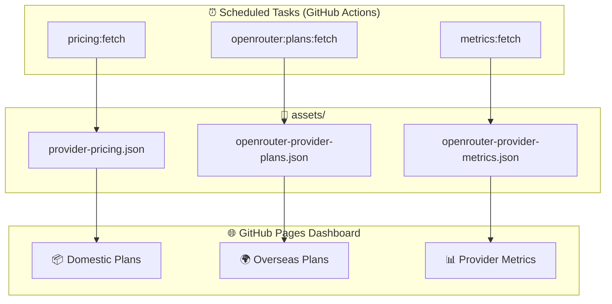

# Coding Plans for Copilot

**Switch between multiple AI model vendors with one click, breaking Copilot plan limitations.**

Supports domestic major vendors like Zhipu, Kimi, iFlytek, Volcengine, MiniMax, Baidu Qianfan, Tencent Cloud, JD Cloud, Kuaishou KAT, X-AIO, Compshare, Alibaba Cloud, Xiaomi MiMo, DeepSeek, as well as **any** vendor compatible with OpenAI Chat, OpenAI Responses, or Anthropic API styles. No need to change usage habits; seamlessly call directly in VS Code Copilot Chat.

---

## Core Features

- **Multi-Protocol Unified Access**: Supports OpenAI Chat (`/chat/completions`), OpenAI Responses (`/responses`), and Anthropic (`/messages`) three protocol styles, adapting to any compatible vendor.
- **Anthropic-Compatible Priority**: Built-in vendors default to Anthropic-compatible endpoints (`/messages`), seamlessly connecting to various models.
- **Zero Learning Curve**: Fully integrated into VS Code Copilot Chat without changing any operational habits.
- **Flexible Model Management**: Supports dynamic fetching from `/models` endpoint, or custom model lists.
- **Intelligent Commit Generation**: Automatically generates Conventional Commits-compliant commit messages based on Git changes.
- **Coding Plans Dashboard**: Visit [GitHub Pages Dashboard](https://jqknono.github.io/coding-plans-for-copilot/) to view monthly fees and benefits from multiple coding plans, as well as OpenRouter vendor performance metrics. The dashboard updates daily with automated scraping, multi-dimensional filtering, and URL state sync.
- **Key Security**: API Keys are stored locally using VS Code Secret Storage, not uploaded to the cloud or shared.

---

## Quick Start

### Installation

**Recommended Method**: Search "Coding Plans" or `Coding Plans for Copilot` directly in the VS Code Marketplace.

#### Method 1: Install within VS Code (Recommended)

1. Open VS Code
2. Press `Ctrl+Shift+X` to open the Extensions panel
3. Type `Coding Plans for Copilot` in the search box
4. Click **Install** to install
5. After installation, press `Ctrl+Shift+P` and type `Coding Plans` to see related commands

#### Method 2: Command Line Installation

```bash
code --install-extension techfetch-dev.coding-plans-for-copilot
```

#### Method 3: Install from Marketplace Page

👉 [VS Code Marketplace Direct Link](https://marketplace.visualstudio.com/items?itemName=techfetch-dev.coding-plans-for-copilot)

Click the **Install** button on the marketplace page, which will automatically open the extension in VS Code and install it.

> **Prerequisites**: Requires VS Code ≥ 1.109.0 and the [GitHub Copilot](https://marketplace.visualstudio.com/items?itemName=GitHub.copilot) extension installed.

### Configuration

1. Press `Ctrl+Shift+P`, type `Coding Plans: Manage Vendor Configuration`
2. Pick the platform you've registered with from the vendor picker (e.g., Zhipu, Kimi, Volcengine, etc.)
3. Select "Set API Key" and paste your API Key; the extension stores it and refreshes models
4. Open Copilot Chat (`Ctrl+L`), choose "Coding Plans" in Add Models, and only enter a Group Name

You can also directly edit `settings.json`; the extension will open settings and navigate to `coding-plans.vendors`.

### Built-in Vendor Endpoints

The following vendors come with built-in default configurations and are ready to use after installation:

| Vendor | Default Built-in Endpoint | Other Compatible Endpoints |
| --- | --- | --- |
| Zhipu (zhipu) | `https://open.bigmodel.cn/api/coding/paas/v4` | `https://open.bigmodel.cn/api/anthropic` (Claude Code) / `https://open.bigmodel.cn/api/paas/v4` (general) |
| z.ai | `https://api.z.ai/api/anthropic` | `https://api.z.ai/api/coding/paas/v4` |
| Volcano Engine | `https://ark.cn-beijing.volces.com/api/coding` | `https://ark.cn-beijing.volces.com/api/coding/v3` |
| Volcengine Overseas | `https://ark.ap-southeast.bytepluses.com/api/coding` | `https://ark.ap-southeast.bytepluses.com/api/coding/v3` |
| Kimi | `https://api.kimi.com/coding/v1` | `https://api.kimi.com/coding/v1` |
| Alibaba Cloud (Aliyun) | `https://token-plan.cn-beijing.maas.aliyuncs.com/apps/anthropic` | `https://token-plan.cn-beijing.maas.aliyuncs.com/compatible-mode/v1` |
| Tencent Cloud | `https://api.lkeap.cloud.tencent.com/plan/anthropic` | `https://api.lkeap.cloud.tencent.com/plan/v3` |
| Xiaomi MiMo | `https://token-plan-cn.xiaomimimo.com/anthropic` | `https://token-plan-cn.xiaomimimo.com/v1` |
| DeepSeek | `https://api.deepseek.com/anthropic` | `https://api.deepseek.com/v1` |
| OpenRouter | `https://openrouter.ai/api` | `https://openrouter.ai/api/v1` |

To switch to OpenAI-compatible endpoints, modify the vendor's `baseUrl` and `defaultApiStyle`.
The built-in Zhipu default uses the dedicated GLM Coding Plan endpoint `https://open.bigmodel.cn/api/coding/paas/v4`. If you want the Claude Code-compatible entrypoint instead, switch `baseUrl` to `https://open.bigmodel.cn/api/anthropic` and set `defaultApiStyle` to `anthropic`.
The built-in Xiaomi MiMo default uses the Token Plan endpoint. If you want pay-as-you-go API access instead, switch `baseUrl` to `https://api.xiaomimimo.com/anthropic` (`https://api.xiaomimimo.com/v1` for OpenAI compatibility) and use the matching API key.

### Configuration Examples

**Anthropic Style Example**

```json
{
  "coding-plans.vendors": [
    {
      "name": "my-anthropic-vendor",
      "baseUrl": "https://api.example.com/anthropic",
      "defaultApiStyle": "anthropic",
      "useModelsEndpoint": false,
      "models": [
        {
          "name": "my-model",
          "capabilities": { "tools": true, "vision": false },
          "contextSize": 128000
        }
      ]
    }
  ]
}
```

**OpenAI Chat Style**

```json
{
  "coding-plans.vendors": [
    {
      "name": "my-openai-vendor",
      "baseUrl": "https://api.example.com/v1",
      "defaultApiStyle": "openai-chat",
      "useModelsEndpoint": true,
      "models": []
    }
  ]
}
```

**OpenAI Responses Style**

```json
{
  "coding-plans.vendors": [
    {
      "name": "openai-responses-demo",
      "baseUrl": "https://api.openai.com/v1",
      "defaultApiStyle": "openai-responses",
      "useModelsEndpoint": false,
      "models": [
        {
          "name": "gpt-5",
          "capabilities": { "tools": true, "vision": false },
          "contextSize": 400000
        }
      ]
    }
  ]
}
```

### Configurable Items

| Config Key | Type | Default Value | Description |
| --- | --- | --- | --- |
| `coding-plans.logLevel` | `string` | `info` | Log level: `debug` / `info` / `warn` / `error`. |
| `coding-plans.vendors` | `array` | Built-in vendor templates | Vendor configuration list. |
| `coding-plans.vendors[].name` | `string` | Required | Vendor unique name. |
| `coding-plans.vendors[].baseUrl` | `string` | Required | API base address. |
| `coding-plans.vendors[].usageUrl` | `string` | Empty | Plan usage API address; when configured, status bar displays quota percentage. |
| `coding-plans.vendors[].defaultApiStyle` | `string` | `openai-chat` | Protocol style: `openai-chat` / `openai-responses` / `anthropic`. |
| `coding-plans.vendors[].defaultTemperature` | `number` | `0.2` | Vendor default temperature. |
| `coding-plans.vendors[].defaultTopP` | `number` | `0` | Vendor default topP. `0` means omit `top_p`. `anthropic` requests always ignore this value and do not send `top_p`. |
| `coding-plans.vendors[].useModelsEndpoint` | `boolean` | `false` | Whether to fetch model list from `/models`. |
| `coding-plans.vendors[].models[].name` | `string` | Required | Model name. |
| `coding-plans.vendors[].models[].description` | `string` | Empty | Model description. |
| `coding-plans.vendors[].models[].apiStyle` | `string` | Inherit from vendor | Model-level protocol style override. |
| `coding-plans.vendors[].models[].temperature` | `number` | Inherit from vendor | Model-level temperature override. |
| `coding-plans.vendors[].models[].topP` | `number` | Inherit from vendor | Model-level topP override. `0` means omit `top_p`. `anthropic` requests always ignore this value and do not send `top_p`. |
| `coding-plans.vendors[].models[].capabilities` | `object` | `{ tools: true, vision: false }` | Model capability declaration. |
| `coding-plans.vendors[].models[].contextSize` | `number` | Empty | Model total context window. When `maxOutputTokens` is unset, runtime derives the implicit reserved output budget from this total window. |
| `coding-plans.vendors[].models[].maxInputTokens` | `number` | Empty | Deprecated,建议使用 `contextSize`. |
| `coding-plans.vendors[].models[].maxOutputTokens` | `number` | `0` | Deprecated,建议使用 `contextSize`. `0` means unset; runtime then derives an implicit reserved output budget as 20% of total context, clamped to 4096-30000. |
| `coding-plans.advanced.defaultReservedOutput` | `number` | `60000` | Request-side default output token budget. It only overrides request budgeting and is still capped by the model output limit. |
| `coding-plans.commitMessage.showGenerateCommand` | `boolean` | `true` | Whether to show "Generate Commit Message" command. |
| `coding-plans.commitMessage.language` | `string` | `en` | Commit message language: `en` / `zh-cn`. |
| `coding-plans.commitMessage.useRecentCommitStyle` | `boolean` | `false` | Whether to reference the style of the last 20 commits. |
| `coding-plans.commitMessage.modelVendor` | `string` | Empty | Preferred vendor name when generating commit messages. |
| `coding-plans.commitMessage.modelId` | `string` | Empty | Preferred model name when generating commit messages. |
| `coding-plans.commitMessage.options.prompt` | `string` | Built-in prompt | Override generation prompt. |
| `coding-plans.commitMessage.options.maxDiffLines` | `number` | `3000` | Maximum number of lines to read from diff. |
| `coding-plans.commitMessage.options.pipelineMode` | `string` | `single` | Generation pipeline: `single` / `two-stage` / `auto`. |
| `coding-plans.commitMessage.options.maxBodyBulletCount` | `number` | `7` | Maximum number of body bullets. |
| `coding-plans.commitMessage.options.subjectMaxLength` | `number` | `72` | Maximum subject length. |
| `coding-plans.commitMessage.options.requireConventionalType` | `boolean` | `true` | Whether to enforce Conventional Commits type. |
| `coding-plans.commitMessage.options.warnOnValidationFailure` | `boolean` | `true` | Whether to show warning on validation failure. |

`API Key` is not stored in plaintext in `settings.json`. Please write it to VS Code Secret Storage via "Set API Key".

### Context Window Display

Limited by VS Code's public API, this extension additionally implements context window display:

- **System Instructions**: System-class prompts occupy (system prompts, mode descriptions, strategy prompts, etc.), counted as prompt tokens.
- **Tool Definitions**: Tool definitions occupy (tool names, descriptions, parameter JSON Schema), counted as prompt tokens.
- **Reserved Output**: Output token budget reserved for this round of response, not the actual generated reply content.
- **Context Window**: The denominator prioritizes `contextSize` from model configuration. The current public API does not provide an interface to return upstream usage breakdown to the native Context Window, so this extension maintains the numerator display of the context window itself.
- Status bar displays a unified `CodingPlans` entry: the body shows a concise percentage of plan usage and context ratio; hover to view detailed information.
- If the vendor has `usageUrl` configured, it additionally displays plan quota percentage.

## Advanced Features

### Intelligent Commit Message Generation

1. Press `Ctrl+Shift+P`, type `Coding Plans: Generate Commit Message`
2. The extension analyzes current Git changes and automatically generates a Conventional Commits-compliant commit message
3. You can select the model to use (defaults to the currently configured vendor)

### Multi-Workspace Independent Configuration

Vendor configurations can be saved per workspace/folder; API Keys are stored in VS Code Secret Storage (local) by vendor name.

## 📊 GitHub Pages Dashboard

<div align="center">

### [🚀 Visit Live Dashboard →](https://jqknono.github.io/coding-plans-for-copilot/)

[](https://jqknono.github.io/coding-plans-for-copilot/)

**Daily Auto-Update** · Multi-Dimensional Filtering · URL State Sync · Responsive Design

</div>

The Coding Plans Dashboard is a real-time data panel deployed on GitHub Pages, aggregating monthly fees and benefits from mainstream domestic AI coding plans, as well as OpenRouter vendor performance metrics. Data is automatically scraped daily via scheduled tasks — no manual maintenance required.

### Dashboard Overview

| Tab | Content | Data Source | Update Frequency |
| --- | --- | --- | --- |
| 📦 **Domestic Plans** | RMB monthly plans (Zhipu, Kimi, Volcengine, etc. 20+ vendors) | Vendor website scraping | Daily 10:00 |
| 🌍 **Overseas Plans** | USD plans (Cerebras, Synthetic, etc.) | OpenRouter API + websites | Daily 16:00 |
| 📊 **Provider Metrics** | Availability, latency (p50/p90/p99), throughput (RPS) | OpenRouter API | Daily 16:00 |

### Features

| Feature | Description |
| --- | --- |
| **Three-Tab Views** | Domestic Plans, Overseas Plans, and OpenRouter Performance Metrics switch independently |
| **Automated Scraping** | Daily scheduled scraping of vendor pricing and performance metrics for reliable, up-to-date data |
| **Multi-Dimensional Filtering** | Cross-filter by model vendor, model name, provider, cache discount, and more |
| **Real-Time Metrics** | Displays vendor availability, latency percentiles (p50/p90/p99), and requests per second (RPS) over the last 30 minutes |
| **Failure Tracking** | Failed scraping items displayed in a collapsible section for easy troubleshooting |
| **URL State Sync** | Filter conditions automatically sync to URL `hash`, supporting link sharing and browser back/forward |
| **Responsive Design** | Perfectly adapts to both desktop and mobile browsing |
| **Zero Backend** | Pure static pages + JSON data files — simple deployment, fast loading |

### Data Pipeline



### Tab Details

#### 📦 Domestic Plans

- **Coverage**: Zhipu, Kimi, iFLYTEK, Volcengine, MiniMax, Baidu Qianfan, Tencent Cloud, JD Cloud, Kuaishou KAT, X-AIO, Compshare, Alibaba Cloud, Infini, Xiaomi MiMo, Moore Threads, StepFun, China Unicom Cloud, National Supercomputing Internet, and 20+ more vendors
- **Currency**: Chinese Yuan (CNY)
- **Filtering Rules**: Standard monthly plans only (excluding annual, quarterly, and first-month promotional prices)
- **Display**: Plan name, price, included quota, validity period, purchase links
- **Error Handling**: Failed scraping items displayed in a collapsible section at the bottom

#### 🌍 Overseas Plans

- **Coverage**: Cerebras Code, Synthetic, Chutes, Kilo Pass, and other OpenRouter vendors
- **Currency**: US Dollar (USD)
- **Data Sources**: OpenRouter API + vendor website Playwright scraping
- **Display**: Plan name, price, included quota, OpenRouter link, official pricing page
- **Error Handling**: Access-restricted or parsing-failed items placed in `Pending` collapsible section

#### 📊 Provider Performance Metrics

- **Availability**: Vendor success request ratio over the last 30 minutes
- **Latency Metrics**:
  - **p50**: Median latency (50% of requests complete within this value)
  - **p90**: 90th percentile latency
  - **p99**: Tail latency (slowest 1% of requests)
- **Throughput Metrics**: Requests processed per second (RPS)
- **Filtering Dimensions**:
  - By model vendor (DeepSeek, Qwen, MoonshotAI, ByteDance, etc.)
  - By model name (deepseek-chat, qwen-max, etc.)
  - By provider (Cerebras, Chutes, Kilo, etc.)
  - By cache discount (with/without prompt cache discount)

### Local Development

```bash
# Install dependencies
npm install

# Fetch latest data (execute in order)
npm run pricing:fetch          # Fetch domestic vendor pricing
npm run metrics:fetch          # Fetch OpenRouter performance metrics
npm run openrouter:plans:fetch # Fetch overseas vendor plans

# Start local preview server
npm run serve:page
# Visit http://127.0.0.1:4173
```

### Data File Structure

The dashboard uses the following core data files (located in the `assets/` directory):

```json
// provider-pricing.json — Domestic vendor monthly plans
{
  "generatedAt": "2026-05-06T12:00:00+08:00",
  "providers": [
    {
      "provider": "zhipu-ai",
      "sourceUrls": ["https://bigmodel.cn/glm-coding"],
      "plans": [
        { "name": "GLM Coding Plan", "price": 199, "currency": "¥", ... }
      ]
    }
  ],
  "failures": []
}
```

```json
// openrouter-provider-metrics.json — Vendor performance metrics
{
  "generatedAt(Beijing)": "2026-05-06 12:00:00",
  "captureWindow": "30 minutes",
  "models": [
    {
      "id": "deepseek/deepseek-chat",
      "organization": "deepseek",
      "providers": [
        { "provider_name": "Cerebras", "uptime": 99.9, "latency_p50": 120, ... }
      ]
    }
  ]
}
```

```json
// openrouter-provider-plans.json — Overseas vendor plans
{
  "providers": [ ... ],
  "pending": [ ... ],
  "summary": { "total": 12, "withPricing": 10 },
  "generatedAt(Beijing)": "2026-05-06 16:00:00"
}
```
  "captureWindow": "30 minutes",
  "models": [
    {
      "id": "deepseek/deepseek-chat",
      "organization": "deepseek",
      "providers": [
        { "provider_name": "Cerebras", "uptime": 99.9, "latency_p50": 120, ... }
      ]
    }
  ]
}
```

---

## Development

Detailed development documentation can be found in [DEV.md](DEV.md).

---

## Changelog

Check [CHANGELOG.md](CHANGELOG.md) for version update details.

---

## Feedback

- **Feature Suggestions**: Submit [Issue](https://github.com/jqknono/coding-plans-for-copilot/issues)
- **Usage Questions**: Include error logs and relevant `settings.json` configuration snippets (with sensitive information redacted) in the Issue
- **Vendor Integration**: Pull Requests are welcome

---

## License

MIT License

---

## Contribution Guidelines

1. Fork this repository
2. Create a feature branch (`git checkout -b feature/AmazingFeature`)
3. Commit changes (`git commit -m 'Add some AmazingFeature'`)
4. Push to the branch (`git push origin feature/AmazingFeature`)
5. Open a Pull Request
