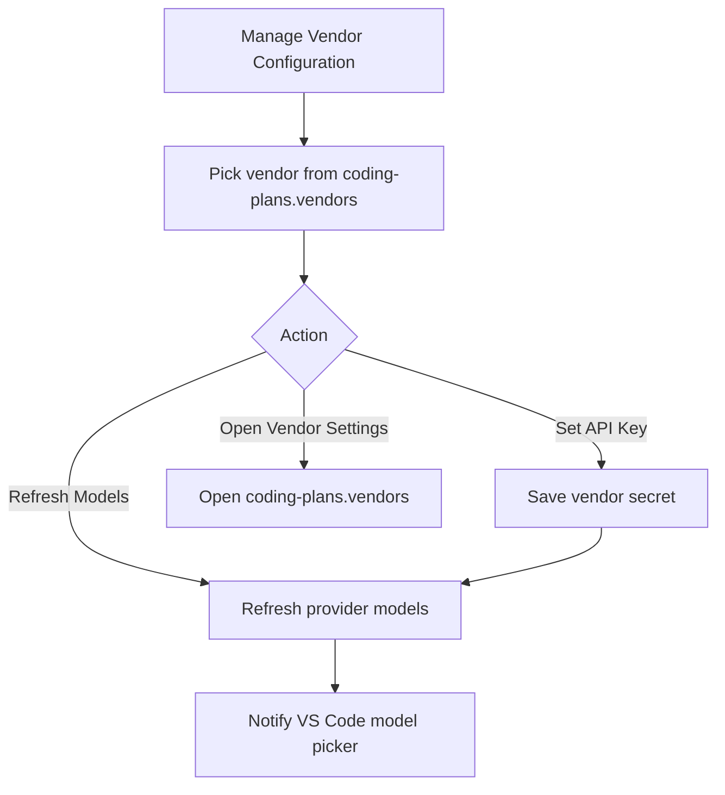

# Model Vendor Picker ATDD

## Feature

| Item | Description |
| --- | --- |
| Goal | Configure Coding Plans vendors without manually typing `vendorName` in Copilot Chat Add Models. |
| Actor | VS Code user with at least one `coding-plans.vendors` entry. |
| Entry | `Coding Plans: Manage Vendor Configuration` command. |

## Acceptance Criteria

| Scenario | Given | When | Then |
| --- | --- | --- | --- |
| Dynamic vendor selection | `coding-plans.vendors` contains `Vendor` | User runs the manage command | `Vendor` appears in a QuickPick list. |
| Store vendor API key | User selected `Vendor` | User chooses `Set API Key` and enters a key | Secret Storage stores the key under the `Vendor` name and models refresh. |
| Add Models without vendor typing | A provider group is added without `vendorName` | VS Code requests model information with only `group` | The extension returns all available Coding Plans models. |
| Legacy vendor filter | A provider group still sends `vendorName: Vendor` | VS Code requests model information | The extension returns only models from `Vendor`. |
| Missing API key | No vendor API key is configured and no models are available | VS Code requests model information | The extension returns the setup placeholder model. |

## Mermaid

