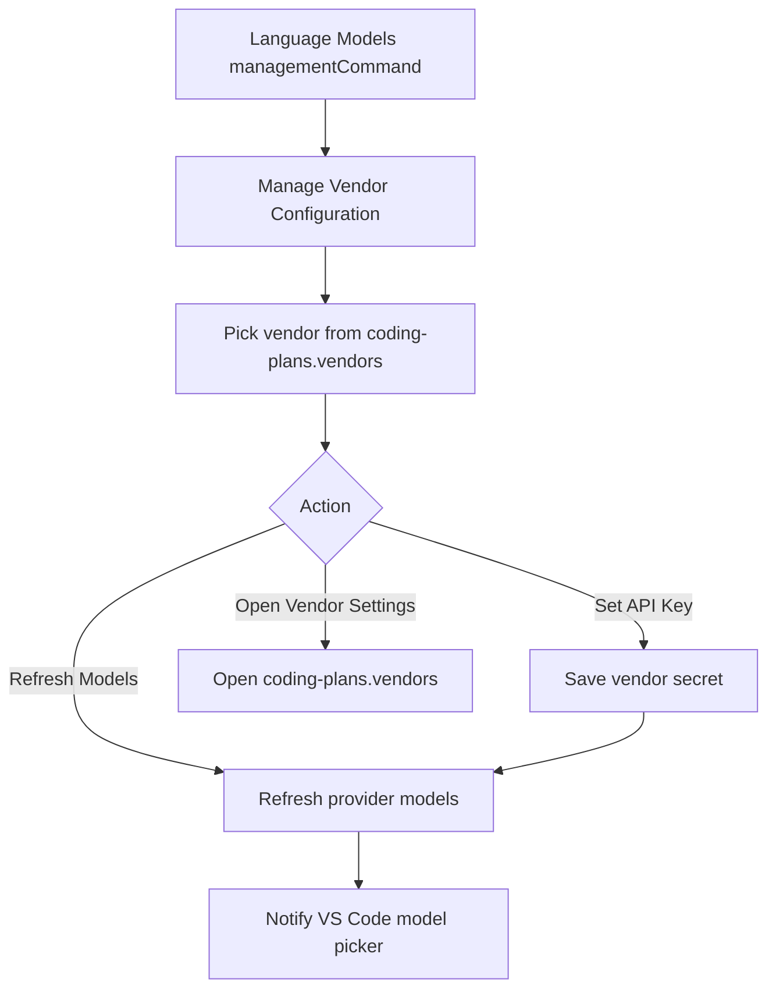

# Model Vendor Management ATDD

## Feature

| Item | Description |
| --- | --- |
| Goal | Configure Coding Plans vendors through the extension management command used by VS Code Language Models. |
| Actor | VS Code user with at least one `coding-plans.vendors` entry. |
| Entry | `Coding Plans: Manage Vendor Configuration` command or the provider `managementCommand`. |

## Acceptance Criteria

| Scenario | Given | When | Then |
| --- | --- | --- | --- |
| Dynamic vendor selection | `coding-plans.vendors` contains `Vendor` | User runs the manage command | `Vendor` appears in a QuickPick list. |
| Store vendor API key | User selected `Vendor` | User chooses `Set API Key` and enters a key | Secret Storage stores the key under the `Vendor` name and models refresh. |
| Refresh vendor models | User selected `Vendor` | User chooses `Refresh Models` | The provider refreshes model discovery and notifies VS Code model picker listeners. |
| Open vendor settings | User selected `Vendor` | User chooses `Open Settings` | VS Code opens `coding-plans.vendors`. |
| Empty provider state | No vendor API key is configured and no models are available | VS Code requests model information | The extension returns an empty model list and relies on `managementCommand` for configuration. |

## Mermaid

