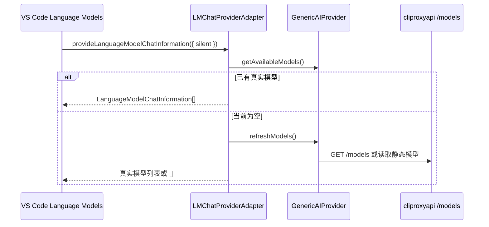

## VS Code 1.120 Language Models Picker 与 cliproxyapi 模型发现

| ID | Given | When | Then |
| --- | --- | --- | --- |
| A1 | VS Code 1.120+ 通过 `vscode.lm.registerLanguageModelChatProvider('coding-plans', provider)` 注册本扩展 | 打开 Copilot Chat 的 Pick model 或后台枚举 `coding-plans` provider | `provideLanguageModelChatInformation({ silent })` 返回当前已配置的真实模型列表 |
| A2 | `coding-plans.vendors` 中存在自定义供应商 `cliproxyapi` 且已有 API Key 或静态模型配置 | VS Code 以 `silent: true` 或 `silent: false` 查询 provider | picker 可展示 `cliproxyapi/o4-mini` 等真实模型 |
| A3 | 当前没有任何可用模型 | VS Code 查询 provider | provider 返回空数组，不返回 setup/no-models placeholder |
| A4 | 用户需要配置供应商或 API Key | 在 VS Code Language Models UI 中触发 provider 管理入口 | VS Code 调用 package contribution 中的 `managementCommand: coding-plans.manage` |
| A5 | 真实模型声明工具调用或图像能力 | provider 返回 `LanguageModelChatInformation` | `capabilities` 只包含公开 API 支持的 `toolCalling/imageInput`，不返回非公开 `agentMode/configurationSchema` 字段 |
| A6 | 提交消息模型选择依赖 `coding-plans` 供应商模型 | 执行 `Coding Plans: Select Commit Message Model` 或生成提交消息 | 命令从扩展内部真实模型源读取模型 |

