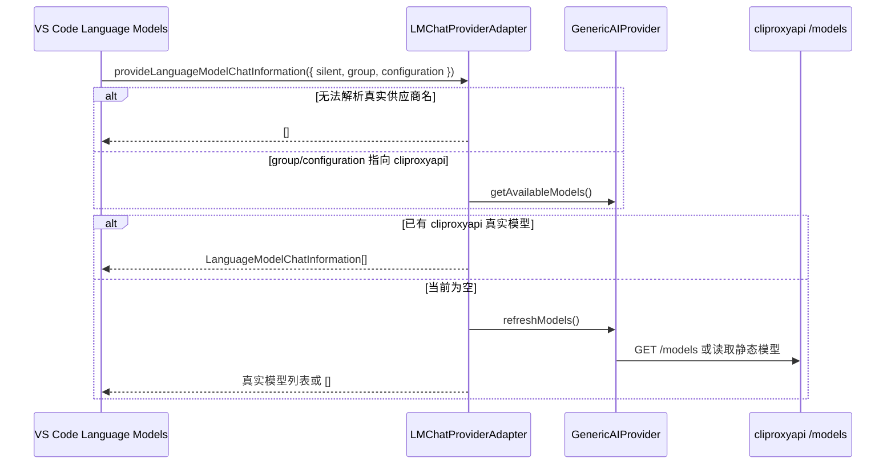

## VS Code 1.120 Language Models Picker 与 cliproxyapi 模型发现

| ID | Given | When | Then |
| --- | --- | --- | --- |
| A1 | VS Code 1.120+ 启动并通过 `onStartupFinished` 激活本扩展 | 扩展创建 adapter 后、模型初始化完成前 | 立即调用 `vscode.lm.registerLanguageModelChatProvider('coding-plans', provider)`，避免首次 picker 解析时 provider 尚未注册 |
| A2 | VS Code 1.120+ 通过 `vscode.lm.registerLanguageModelChatProvider('coding-plans', provider)` 注册本扩展 | VS Code 以无 `group`/`configuration` 的根 provider 查询模型 | `provideLanguageModelChatInformation({ silent })` 返回空列表，避免默认 `Coding Plans` 根 group 暴露模型 |
| A3 | `coding-plans.vendors` 中存在自定义供应商 `cliproxyapi` 且已有 API Key 或静态模型配置 | VS Code 以 `group=cliproxyapi` 或 `configuration.vendorName=cliproxyapi` 查询 provider | picker 可展示 `cliproxyapi/o4-mini` 等真实模型 |
| A4 | 当前没有任何可用模型 | VS Code 查询 provider | provider 返回空数组，不返回 setup/no-models placeholder |
| A5 | VS Code 以默认显示名 `group=Coding Plans` 查询 provider | `coding-plans.vendors` 中存在 `cliproxyapi` 等真实供应商模型 | provider 返回空数组，不把真实模型归到默认 `Coding Plans` group |
| A6 | 真实模型声明工具调用或图像能力 | provider 返回 `LanguageModelChatInformation` | `capabilities` 只包含公开 API 支持的 `toolCalling/imageInput`，不返回非公开 `agentMode/configurationSchema` 字段 |
| A7 | 提交消息模型选择依赖 `coding-plans` 供应商模型 | 执行 `Coding Plans: Select Commit Message Model` 或生成提交消息 | 命令从扩展内部真实模型源读取模型 |

