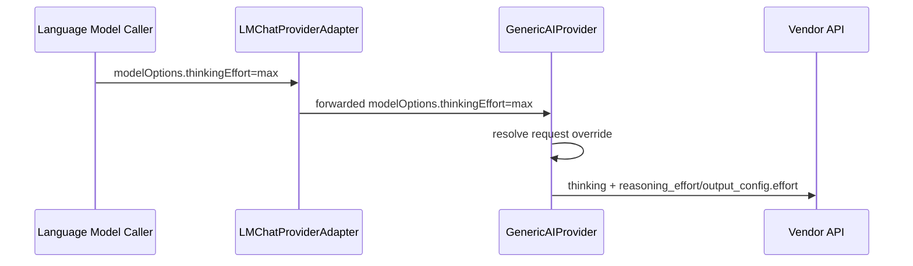

## 模型独立 Thinking Effort

| ID | Given | When | Then |
| --- | --- | --- | --- |
| A1 | `request.modelOptions.thinkingEffort = none` | 对该模型发起 `openai-chat` 请求 | 上游 payload 包含 `thinking: { type: "disabled" }`，且不包含 effort 字段 |
| A2 | `request.modelOptions.thinkingEffort = high` | 对该模型发起 `openai-responses` 请求 | 上游 payload 包含 `thinking: { type: "enabled" }` 与 `reasoning_effort: "high"` |
| A3 | `request.modelOptions.thinkingEffort = max` | 对该模型发起 `anthropic` 请求 | 上游 payload 包含 `thinking: { type: "enabled" }` 与 `output_config.effort: "max"` |
| A4 | `LanguageModelChatInformation` 按 VS Code 1.120 公开接口返回 | 打开 Language Models picker | 模型信息只包含公开 API 定义的字段 |
| A5 | `modelOptions` 同时带有内部 source 标记、`temperature` 与 `thinkingEffort` | adapter 转发请求 | 仅剥离内部 source 标记，保留请求级覆盖项 |

