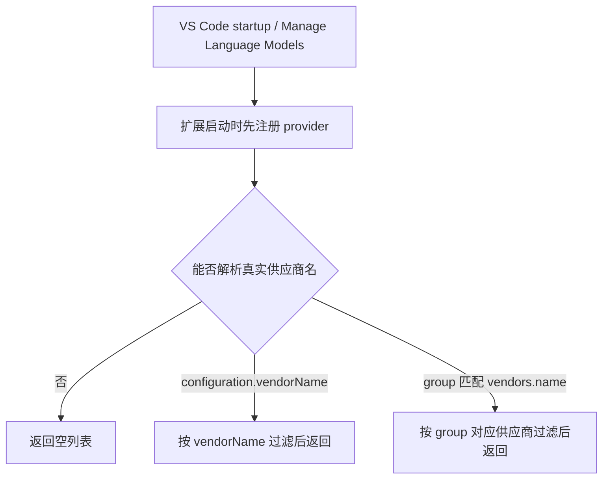

# Manage Language Models 隐藏默认根分组

## Feature

在 VS Code `Manage Language Models` 中，`coding-plans` provider 不应自动展示默认的 `Coding Plans` 根 group。只有用户显式添加 provider group 后，扩展才应暴露对应模型。

## Scenarios

| Scenario | Given | When | Then |
| --- | --- | --- | --- |
| 未显式添加 group 时隐藏根 provider | 扩展已激活，且 `coding-plans.vendors` 中至少有一个可用模型 | VS Code 以未携带 `group`/`configuration` 的 provider 根查询请求模型信息 | 扩展返回空列表，管理页不显示默认 `Coding Plans` group。 |
| 启动后首次解析不落入默认显示名 | VS Code 启动后尚未打开 Manage Language Models | 扩展通过 `onStartupFinished` 激活，并在模型初始化前注册 `coding-plans` provider | VS Code 首次解析 provider group 时能进入 adapter，不因 provider 未注册而回退到 `Coding Plans`。 |
| 默认显示名 group 仍隐藏根 provider | 扩展已激活，且 `coding-plans.vendors` 中至少有一个可用模型 | VS Code 以 `group=Coding Plans` 且未携带 `configuration.vendorName` 查询模型信息 | 扩展返回空列表，不把真实模型挂到默认 `Coding Plans` group 下。 |
| 真实供应商 group 时返回对应模型 | provider 内部已有可用模型，且 `group` 匹配 `coding-plans.vendors[].name` | VS Code 以带真实供应商 `group` 的请求查询模型信息 | 扩展只返回该供应商的模型。 |
| 显式 vendorName 时按供应商过滤 | `coding-plans.vendors` 同时配置了 `Vendor` 与 `Other` | VS Code 以 `group + configuration.vendorName=Vendor` 查询模型信息 | 仅返回 `Vendor` 家族模型。 |

## Mermaid

