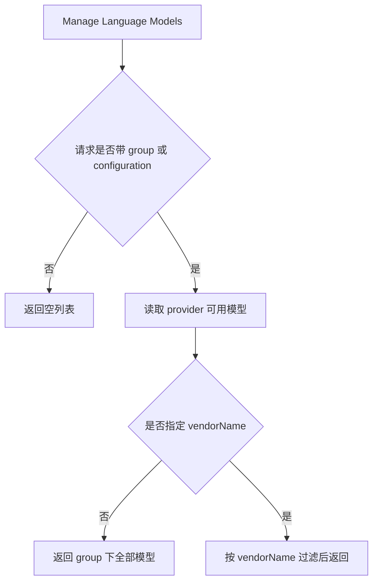

# Manage Language Models 隐藏默认根分组

## Feature

在 VS Code `Manage Language Models` 中，`coding-plans` provider 不应自动展示默认的 `Coding Plans` 根 group。只有用户显式添加 provider group 后，扩展才应暴露对应模型。

## Scenarios

| Scenario | Given | When | Then |
| --- | --- | --- | --- |
| 未显式添加 group 时隐藏根 provider | 扩展已激活，且 `coding-plans.vendors` 中至少有一个可用模型 | VS Code 以未携带 `group`/`configuration` 的 provider 根查询请求模型信息 | 扩展返回空列表，管理页不显示默认 `Coding Plans` group。 |
| 显式 group 时仍可返回模型 | provider 内部已有可用模型 | VS Code 以带 `group` 的请求查询模型信息 | 扩展返回真实模型列表。 |
| 显式 vendorName 时按供应商过滤 | `coding-plans.vendors` 同时配置了 `Vendor` 与 `Other` | VS Code 以 `group + configuration.vendorName=Vendor` 查询模型信息 | 仅返回 `Vendor` 家族模型。 |

## Mermaid

