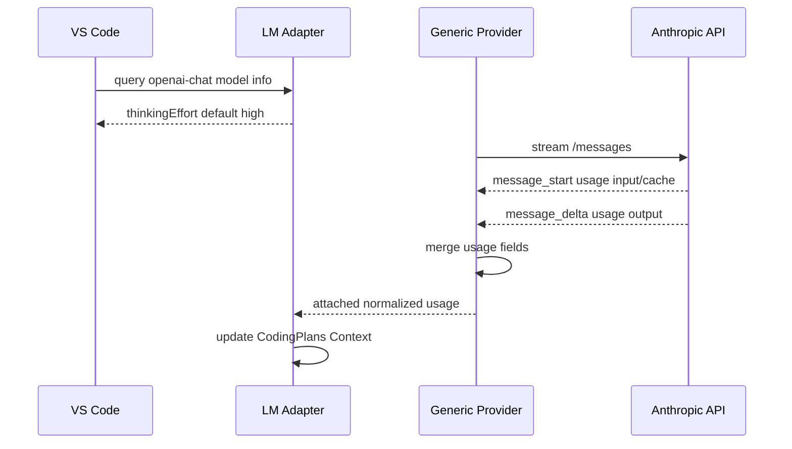

## Thinking 默认值与 Anthropic Usage 合并验收

| ID | Given | When | Then |
| --- | --- | --- | --- |
| A1 | 模型协议风格为 `openai-chat` | VS Code 请求 `LanguageModelChatInformation` | `configurationSchema.properties.thinkingEffort.default` 为 `high` |
| A2 | Anthropic 流式响应先在 `message_start` 返回 `input_tokens` 与 cache token | 后续 `message_delta` 只返回 `output_tokens` | 最终 usage 合并保留输入、缓存输入与输出统计 |
| A3 | Anthropic 流式请求完成且 usage 合并成功 | adapter 读取响应 usage | `CodingPlans Context` 状态栏可用真实上下文占用更新展示 |

