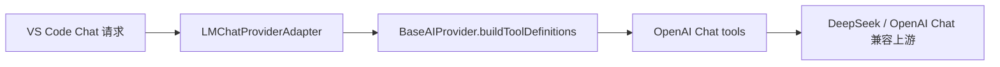

# OpenAI Chat 工具定义运行时形态

## 背景

VS Code Chat 请求在部分运行时会把工具定义传入为 OpenAI function 形态：

若只读取顶层 `tool.name`，会生成缺少 `tools[].function.name` 的请求体，上游返回 400。

## 验收用例

| ID | 前置条件 | 操作 | 期望 |
| --- | --- | --- | --- |
| A1 | `request.options.tools[0]` 使用 VS Code 顶层 `name/description/inputSchema` 形态 | 构造 OpenAI Chat 请求 | `tools[0].function.name`、`description`、`parameters` 正确保留，schema 仍移除 VS Code 扩展字段 |
| A2 | `request.options.tools[0]` 使用 OpenAI `function.name/function.description/function.parameters` 形态 | 构造 OpenAI Chat 请求 | `tools[0].function.name` 保留为运行时 `function.name`，不再发送缺少名称的工具 |
| A3 | 工具定义同时缺少顶层 `name` 与 `function.name` | 构造工具定义 | 扩展侧抛出明确的工具定义错误，不向上游发送无效 OpenAI Chat payload |

## 覆盖

| Covered assertion | Result |
| --- | --- |
| `PASS 工具定义可接受运行时 OpenAI function 形态并保留 function.name` | Passed |
