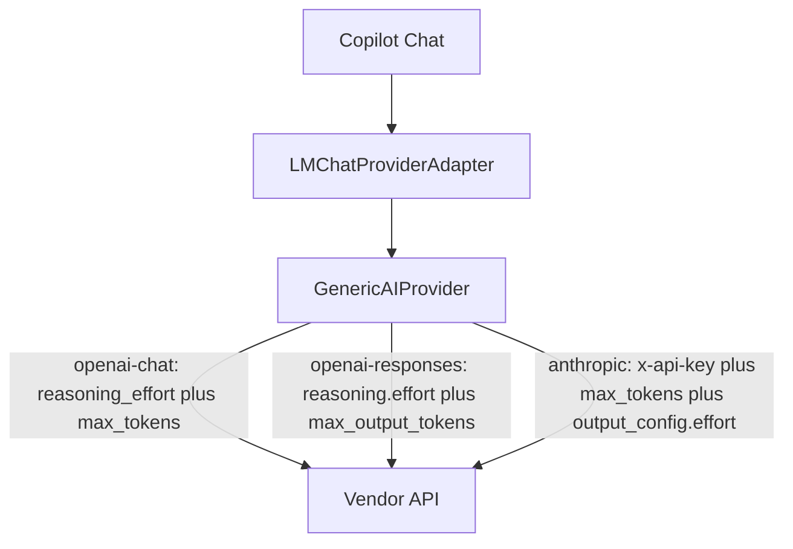

## 对齐原生 Custom Endpoint 默认请求包

默认 HTTP 请求对齐 VS Code 原生 Custom Endpoint：openai-chat 默认只发顶层 `reasoning_effort`；openai-chat / openai-responses 带输出上限；未设置 `authType` 时 anthropic 只使用 `x-api-key`。供应商可显式覆盖认证，见 [issue #376](issue-376-volcengine-coding-auth.md)。插件不再提供 `enableExtraRequestWrapping` 开关。

| ID | Given | When | Then |
| --- | --- | --- | --- |
| A1 | `openai-chat`，模型有输出窗口 | 发起聊天请求，仅带 `thinkingEffort` | 上游 payload 含 `reasoning_effort` 与 `max_tokens`（reserved 再被模型 `maxOutputTokens` 封顶），不含 `thinking`、`temperature`、`top_p` |
| A2 | `openai-responses`，模型有输出窗口 | 发起聊天请求，带 `thinkingEffort` | 上游 payload 含 `reasoning.effort` 与 `max_output_tokens`，不含 `thinking`、`instructions`、`top_p` |
| A3 | `anthropic` 协议，未设置 `authType` | 发起 `/messages` 请求 | 请求头含 `x-api-key` 与 `anthropic-version`，不含 `Authorization` |
| A4 | `openai-chat` 协议，未设置 `authType` | 发起 `/chat/completions` 请求 | 请求头含 `Authorization: Bearer`，不含 `x-api-key` |
| A5 | `openai-chat` 配置了 `defaultTemperature` / `defaultTopP` | 发起聊天请求 | 首次 payload 已含 `max_tokens`，不含 `temperature` / `top_p`，也不会因 missing-`max_tokens` 自动重试 |
| A6 | `settings.json` 仍残留 `enableExtraRequestWrapping` | 读取供应商配置并发起聊天 | 该字段被忽略，请求路径与 A1–A5 相同 |

