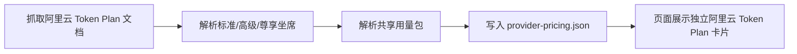

# 阿里云 Token Plan 套餐展示

| 项目 | 内容 |
| --- | --- |
| 目标 | 大陆套餐页展示阿里云 Token Plan 团队版套餐 |
| 数据来源 | 阿里云帮助中心 `Token Plan（团队版）概述` 与活动页 |
| 入口 | `npm run pricing:fetch` 生成 `assets/provider-pricing.json` |
| 页面 | `npm run serve:page` 后在“大陆套餐”中显示 `阿里云 Token Plan` |

## 验收

| 场景 | Given | When | Then |
| --- | --- | --- | --- |
| 团队版坐席套餐 | 文档包含坐席类型、价格、额度、适用场景表格 | 执行 `pricing:fetch` | 输出 `Token Plan 标准坐席`、`高级坐席`、`尊享坐席` |
| 共享用量包 | 文档包含共享用量包价格和 Credits | 执行 `pricing:fetch` | 输出 `Token Plan 共享用量包` 并保留 1 个月有效期说明 |
| 页面展示 | `provider-pricing.json` 含 `aliyun-token-plan` | 打开看板大陆套餐页 | 出现“阿里云 Token Plan”卡片和购买入口 |
