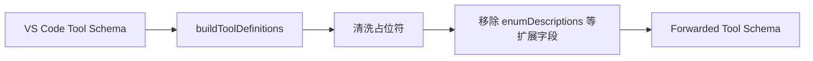

## Anthropic Tool Schema Sanitization Acceptance

| ID | Scenario | Expected |
| --- | --- | --- |
| A1 | VS Code tool schema 含 `enumDescriptions` | 转发给上游前移除该字段 |
| A2 | VS Code tool schema 含 `markdownDescription` 等编辑器扩展字段 | 转发给上游前移除该字段 |
| A3 | schema 中标准 JSON Schema 字段仍存在 | `type`、`properties`、`description` 等结构保持可用 |
| A4 | schema 字符串中出现未解析占位符如 `{1}` | 仍按既有逻辑清洗为 `value` |

