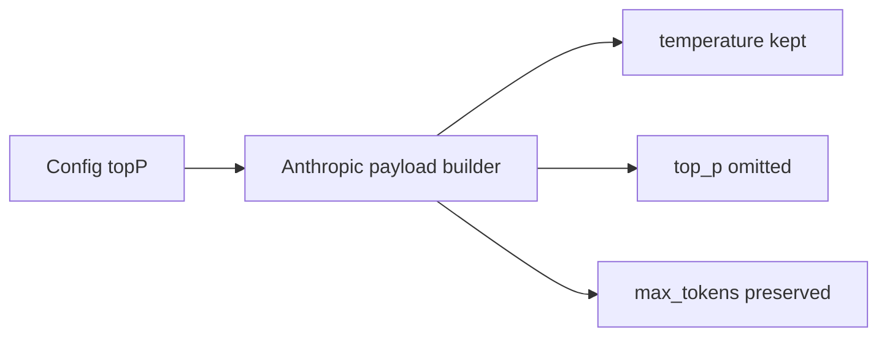

## Anthropic Top-P Compatibility Acceptance

| Item | Scenario | Expected |
| --- | --- | --- |
| A1 | 供应商或模型配置了 `topP`，且协议风格为 `anthropic` | 请求仍发送 `temperature` |
| A2 | 协议风格为 `anthropic` | 请求体不包含 `top_p` |
| A3 | `anthropic` 请求发送时 | `max_tokens` 仍按现有规则下发，不影响现有输出预算逻辑 |
| A4 | `openai-chat` / `openai-responses` 请求发送时 | 现有 `top_p` 行为不回退 |

## Verification

| Check | Command | Result |
| --- | --- | --- |
| Regression tests | `npm run typecheck` | Passed |
| Regression tests | `npm run lint` | Passed |
| Regression tests | `node ./out/test/runTest.js` | Passed |
| Covered assertion | `PASS anthropic 请求会保留 temperature 但不发送 top_p` | Passed |
