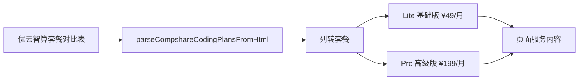

# 优云智算套餐展示修复

| 项目 | 内容 |
| --- | --- |
| 目标 | 修复优云智算对比表被误解析为单套餐的问题 |
| 入口 | `npm run pricing:fetch` |
| 输出 | `assets/provider-pricing.json` 中 `compshare-ai` 包含 Lite / Pro 两个套餐 |
| 页面 | `npm run serve:page` 后大陆套餐页展示两个价格卡片 |

| 场景 | 前置条件 | 操作 | 期望 |
| --- | --- | --- | --- |
| 列式套餐表 | 表头包含 `Lite 基础版`、`Pro 高级版`，`月费` 行包含两个价格 | 执行解析 | 输出两个套餐，不输出名为 `月费` 的套餐 |
| 服务内容 | 对比表包含调用次数、RPM、并发、模型、OpenClaw 等行 | 执行解析 | 每个套餐的 `serviceDetails` 包含对应列权益 |
| 页面展示 | `provider-pricing.json` 已生成 | 打开大陆套餐页 | 优云智算卡片显示 Lite / Pro 两个套餐，Lite 的服务内容不再出现孤立 `¥199/月` |
