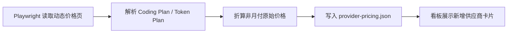

# 新增 Coding / Token Plan 供应商抓取

| 项目 | 内容 |
| --- | --- |
| 目标 | 将摩尔线程、阶跃星辰、联通云、国家超算互联网、Cerebras、Synthetic、Chutes、Kilo Pass 纳入 `pricing:fetch` |
| 入口 | `npm run pricing:fetch` |
| 输出 | `assets/provider-pricing.json` |
| 页面 | 看板按人民币/美元自动拆分大陆与海外套餐 |

## 验收

| 场景 | Given | When | Then |
| --- | --- | --- | --- |
| 国内 Coding Plan | 摩尔线程、阶跃星辰、联通云页面可访问 | 执行 `pricing:fetch` | 输出 `mthreads-coding-plan`、`stepfun-step-plan`、`cucloud-coding-plan` |
| SCNet 官方文档 | 订阅须知文档包含套餐详情表格 | 执行 `pricing:fetch` | 输出 `scnet-coding-plan`，包含 Lite/Pro 价格、额度、模型和工具说明 |
| 海外 Coding/API 计划 | Cerebras、Synthetic、Chutes、Kilo 页面可访问 | 执行 `pricing:fetch` | 输出对应美元月付套餐 |
| 看板入口 | `provider-pricing.json` 含新增 provider id | 打开看板 | 显示可读供应商名与购买/来源链接 |
