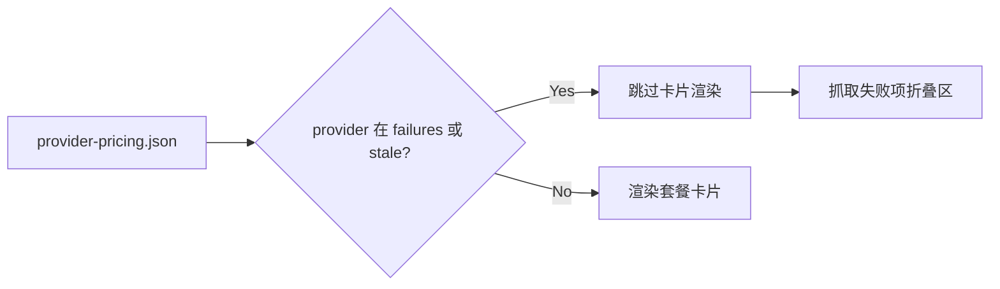

# Issue 105 抓取失败项不显示卡片

| 项目 | 内容 |
| --- | --- |
| 目标 | 价格抓取失败的 provider 不在页面展示套餐卡片 |
| 入口 | `pages/app.js` 消费 `assets/provider-pricing.json` |
| 回归测试 | `tests/pages/github-pages.spec.ts` |

## 验收用例

| 场景 | Given | When | Then |
| --- | --- | --- | --- |
| 失败 provider 有旧快照 | `provider-pricing.json` 同时包含 `failures[]` 与带 `staleReason` 的旧 provider 数据 | 打开大陆套餐页 | 对应 provider 卡片不渲染，只在“抓取失败项”折叠区显示失败信息 |
| 正常 provider 同时存在 | 同一份 JSON 中还有无失败记录的 provider | 打开大陆套餐页 | 正常 provider 卡片继续展示 |

