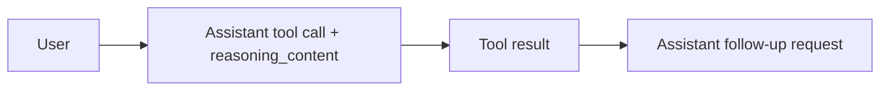

## Issue 98 Acceptance

| Item | Scenario | Expected |
| --- | --- | --- |
| A1 | `deepseek-v4-flash` 首轮返回 `reasoning_content + tool_calls` | 扩展响应中保留隐藏 reasoning 元数据，不向用户展示思考文本 |
| A2 | 工具执行后继续同一轮请求 | 第二次上游请求的 assistant 消息包含原始 `reasoning_content` |
| A3 | VS Code 未把隐藏 reasoning part 回传给扩展 | 扩展仍可基于 `tool_call_id` 本地恢复并透传 `reasoning_content` |
| A4 | 同一轮继续请求 | tool result 仍按 `role=tool` / `tool_call_id` 回传 |
| A5 | 非工具调用的普通文本流式响应 | 现有文本输出行为不回退，不引入可见回归 |

## Verification

| Check | Command | Result |
| --- | --- | --- |
| Regression tests | `npm test` | Passed |
| Covered assertion | `PASS openai-chat 会在 tool continuation 中保留并回传 reasoning_content` | Passed |
