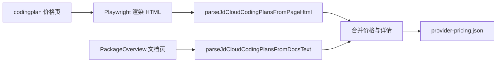

# 京东云 Coding Plan 价格页抓取

| 项目 | 内容 |
| --- | --- |
| 目标 | 修复 `jdcloud-ai: fetch failed`，从京东云 Coding Plan 价格页解析价格，并用 JoyBuilder 文档补充套餐详情 |
| 入口 | `npm run pricing:fetch` |
| 价格来源 | `https://www.jdcloud.com/cn/pages/codingplan` |
| 详情来源 | `https://docs.jdcloud.com/cn/jdaip/PackageOverview` |
| 输出 | `assets/provider-pricing.json` 中 `jdcloud-ai` 包含 Lite / Pro 价格与套餐详情 |

| 场景 | 前置条件 | 操作 | 期望 |
| --- | --- | --- | --- |
| 价格页可访问 | 页面包含 `Coding Plan Lite`、`Coding Plan Pro`、原价与当前价 | 执行 `pricing:fetch` | 输出两个套餐及 `currentPriceText` |
| 文档页可访问 | 京东云文档包含 `套餐详情`、`Lite套餐`、`Pro套餐` | 执行 `pricing:fetch` | Lite / Pro 的 `serviceDetails` 包含用量限制、支持模型与工具 |
| 页面入口 | 看板渲染 `jdcloud-ai` | 点击 `前往了解` | 打开京东云 Coding Plan 价格页 |
