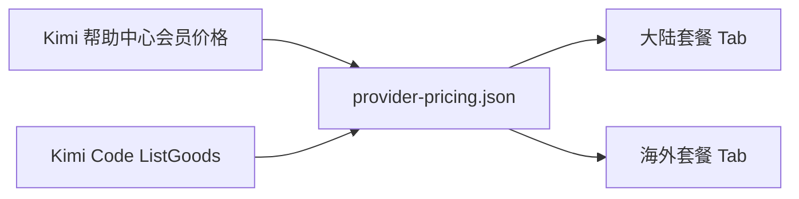

# Moonshot Kimi 海内外套餐币种验收

| 项目 | 内容 |
| --- | --- |
| 背景 | Moonshot Kimi 同时存在大陆人民币会员套餐与海外美元 Kimi Code Plan |
| 目标 | 看板在大陆/海外两个 Tab 分别展示对应套餐，并明确人民币（CNY）或美元（USD） |
| 数据入口 | `npm run pricing:fetch`、`npm run openrouter:plans:fetch` |

| 验收点 | 期望 |
| --- | --- |
| 大陆套餐 | `kimi-ai` 至少包含 `Andante（大陆）`、`Moderato（大陆）` 等人民币价格，价格文本使用 `¥` |
| 海外套餐 | `kimi-ai` 至少包含 `Moderato（海外）`、`Vivace（海外）` 等美元价格，价格文本使用 `$` |
| 币种说明 | 大陆计划服务详情包含 `计价币种: 人民币（CNY）`，海外计划服务详情包含 `计价币种: 美元（USD）` |
| 页面展示 | 大陆 Tab 只将人民币套餐作为主列表，海外 Tab 只将美元套餐作为主列表 |
| OpenRouter 合并 | `moonshotai` provider 继承同样的海内外套餐数据 |

