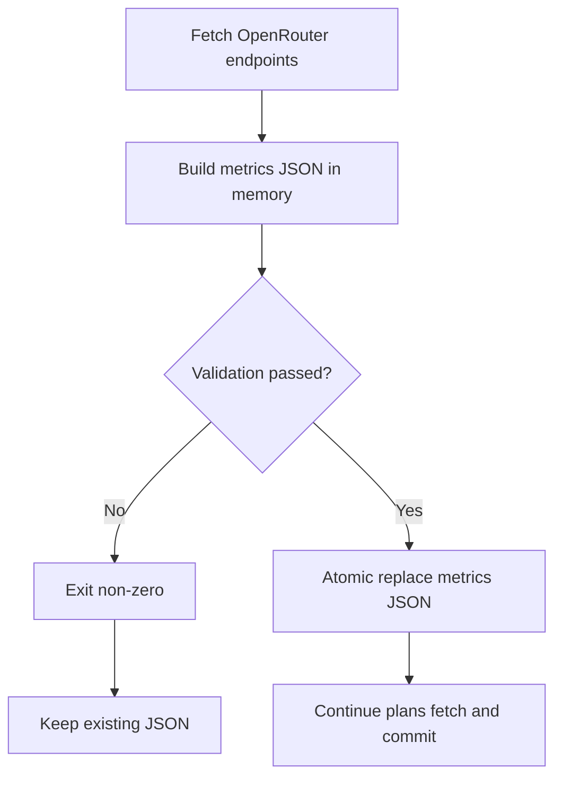

# OpenRouter 性能指标失败即停止

| 项目 | 内容 |
|---|---|
| 目标 | OpenRouter provider 性能指标不可用时，Action 失败且不更新已有指标数据 |
| 入口 | `npm run metrics:fetch`、`.github/workflows/update-openrouter-metrics.yml` |
| 数据文件 | `assets/openrouter-provider-metrics.json` |

## 验收用例

| 场景 | Given | When | Then |
|---|---|---|---|
| 性能分位数全空 | OpenRouter endpoint 响应仍有 provider 与 uptime，但所有 `latency_last_30m` / `throughput_last_30m` 均为 `null` | 执行 `metrics:fetch` | 脚本非 0 退出，并保留已有 `openrouter-provider-metrics.json` |
| endpoint 请求失败 | 任一目标模型 endpoint 请求返回错误 | 执行 `metrics:fetch` | 脚本非 0 退出，不写入半成品 JSON |
| 部分 endpoint 无数据 | 至少一个 endpoint 有完整 `p50/p75/p90/p99` latency 与 throughput，少数 endpoint 因数据不足返回 `null` | 执行 `metrics:fetch` | 脚本通过，并写入新 JSON |
| API Key 环境变量统一 | `.env` 或 GitHub secret 仅配置 `APIKEY` | 执行 `metrics:fetch` 与 `openrouter:plans:fetch` | 两个脚本均读取 `APIKEY`，不再依赖旧变量名 |
| Action 阻断提交 | `metrics:fetch` 或 OpenRouter 失败检测出现失败 | 运行 `update-openrouter-metrics` workflow | workflow 失败，`Commit metrics changes` 不执行 |
| 提交前远端已更新 | 抓取与失败检测均通过，但 checkout 后远端 `main` 出现新提交 | 执行 `Commit metrics changes` | workflow 先 rebase 到最新远端分支，并重试 push，避免非 fast-forward 直接失败 |

## 流程

