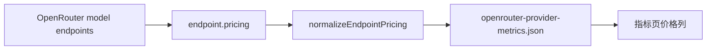

# OpenRouter Provider 指标价格列

| 项目 | 内容 |
| --- | --- |
| 目标 | 供应商性能指标页展示 OpenRouter endpoint 的 1M 输入、输入缓存命中、输出价格，并支持缓存优惠筛选 |
| 入口 | `npm run metrics:fetch` 生成 `assets/openrouter-provider-metrics.json` |
| 页面 | `npm run serve:page` 后打开 `/#metrics` |

| 场景 | Given | When | Then |
| --- | --- | --- | --- |
| Endpoint 含缓存读折扣 | `pricing.prompt` 与 `pricing.input_cache_read` 均存在，且缓存读单价更低 | 执行 `metrics:fetch` | 输出 `pricing.has_input_cache_read_discount: true` |
| Endpoint 无缓存读优惠价 | `pricing.input_cache_read` 缺失、为 `0`、或不低于 `pricing.prompt` | 打开指标页 | 价格列不显示“缓存命中”行，也不显示“缓存折扣”标记 |
| Endpoint 含缓存读折扣 | `pricing.input_cache_read` 为正数且低于 `pricing.prompt` | 打开指标页 | 展示“缓存命中”行和带折扣率的“缓存折扣”标记 |
| 页面价格单位 | metrics JSON 中价格为 OpenRouter 每 token 美元价格，且包含抓取时 USD/CNY 汇率 | 打开指标页 | 价格列按 1M token 折算，只展示人民币价格 |
| 价格列排序 | 表格同时存在有缓存命中价与无缓存命中价的 endpoint | 点击 `1M价格(入/缓存/出)` 表头升序排序 | 有缓存命中价的 endpoint 按 `pricing.input_cache_read` 排序；无缓存命中价的 endpoint 使用 `pricing.prompt` 作为排序值 |
| 缓存优惠筛选 | 指标数据中同时存在支持与不支持缓存优惠的 endpoint | 选择“支持缓存优惠” | 表格只展示有 `has_input_cache_read_discount` 的 endpoint |
| URL 筛选恢复 | URL 带有 `metricsOrg`、`metricsModel`、`metricsProvider` 或 `metricsCacheDiscount` 参数 | 打开 `/#metrics` | 筛选控件恢复对应选项，表格按 URL 条件过滤 |
| 费用提示 | 用户查看 OpenRouter 价格估算 | 打开指标页 | 页面提示 OpenRouter 平台手续费与支付渠道手续费可能影响实际支付 |
