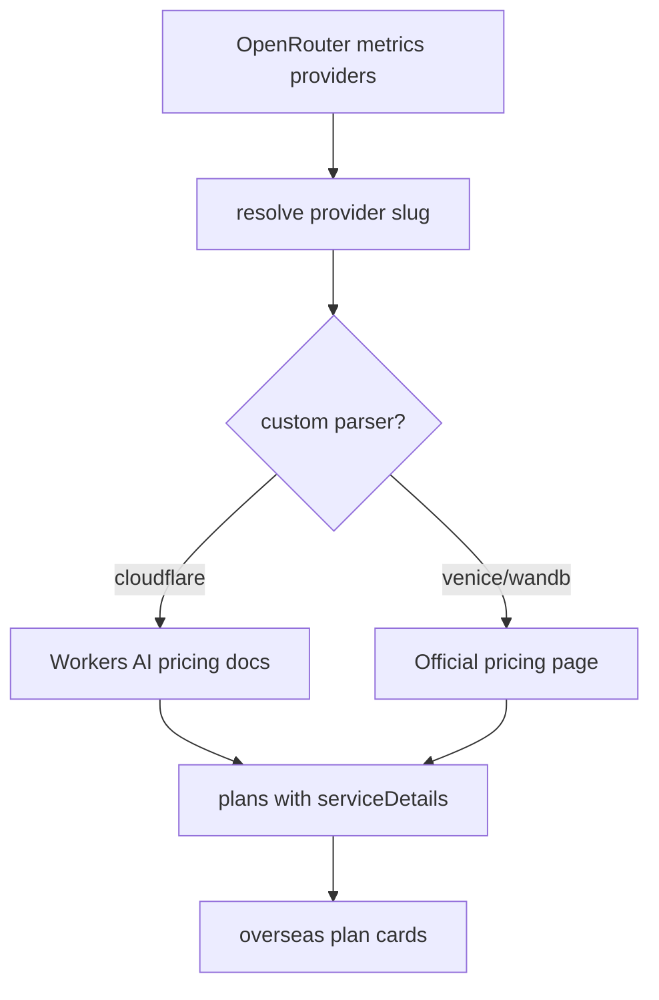

# OpenRouter Provider 套餐服务详情展示

| 项目 | 内容 |
| --- | --- |
| 目标 | 海外套餐页展示 Venice、WandB 的服务详情，并让 Cloudflare 展示 Workers AI / LLM 相关计费详情 |
| 入口 | `npm run openrouter:plans:fetch` 生成 `assets/openrouter-provider-plans.json` |
| 页面 | `npm run serve:page` 后在“海外套餐”中显示服务内容列表 |
| 测试 | `npx playwright test --config=playwright.config.ts` |

| 场景 | Given | When | Then |
| --- | --- | --- | --- |
| Venice 详情 | `venice` provider 存在 | 执行 `openrouter:plans:fetch` | 输出 `Pro`、`Pro Plus`、`Max`，且包含 credits / LLM / API 明细 |
| WandB 详情 | `wandb` provider 存在 | 执行 `openrouter:plans:fetch` | 输出 `Pro` 与 `Inference add-on`，且包含 AI app / inference 明细 |
| Cloudflare LLM 详情 | `cloudflare` provider 存在 | 执行 `openrouter:plans:fetch` | 价格页指向 Workers AI pricing，且服务内容包含 Neurons 与 LLM token pricing 示例 |
| 页面展示 | `openrouter-provider-plans.json` 已生成 | 打开 `/#overseas` | 三个 provider 卡片均出现“服务内容”列表 |
