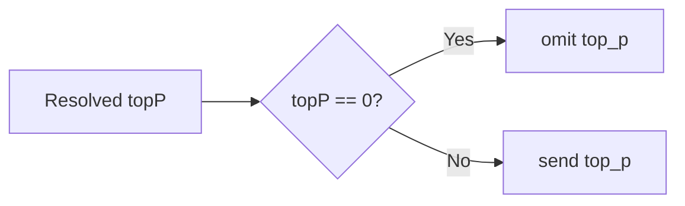

## Top-P Zero Omit Request Acceptance

| Item | Scenario | Expected |
| --- | --- | --- |
| A1 | 未配置 `defaultTopP` / `topP` | 运行时默认 `topP = 0` |
| A2 | `openai-chat` 请求且解析后的 `topP = 0` | 请求体不包含 `top_p` |
| A3 | `openai-responses` 请求且解析后的 `topP = 0` | 请求体不包含 `top_p` |
| A4 | 供应商 `defaultTopP > 0` | 请求体包含对应 `top_p` |
| A5 | 模型 `topP = 0` 且供应商 `defaultTopP > 0` | 模型显式覆盖供应商默认值，请求体不包含 `top_p` |

## Verification

| Check | Command | Result |
| --- | --- | --- |
| Regression tests | `npm run typecheck` | Passed |
| Regression tests | `npm run lint` | Passed |
| Regression tests | `npm test` | Passed |
| Covered assertion | `PASS openai-chat 模型显式 topP=0 时会覆盖供应商默认值并省略 top_p` | Passed |
