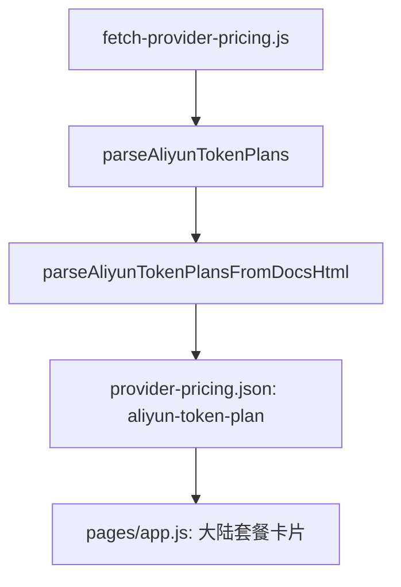

# 阿里云 Token Plan 套餐抓取说明

| 模块 | 说明 |
| --- | --- |
| provider id | `aliyun-token-plan` |
| 标签 | `阿里云 Token Plan` |
| 主要数据源 | `https://help.aliyun.com/zh/model-studio/token-plan-overview` |
| 辅助入口 | `https://www.aliyun.com/benefit/scene/tokenplan` |
| 购买入口 | `https://common-buy.aliyun.com/token-plan/` |

## 数据流

| 套餐 | 价格字段 | 关键明细 |
| --- | --- | --- |
| Token Plan 标准坐席 | `¥198/坐席/月` | `25,000 Credits/坐席/月` |
| Token Plan 高级坐席 | `¥698/坐席/月` | `100,000 Credits/坐席/月` |
| Token Plan 尊享坐席 | `¥1,398/坐席/月` | `250,000 Credits/坐席/月` |
| Token Plan 共享用量包 | `¥5,000/个` | `625,000 Credits/个`，有效期 1 个月 |
