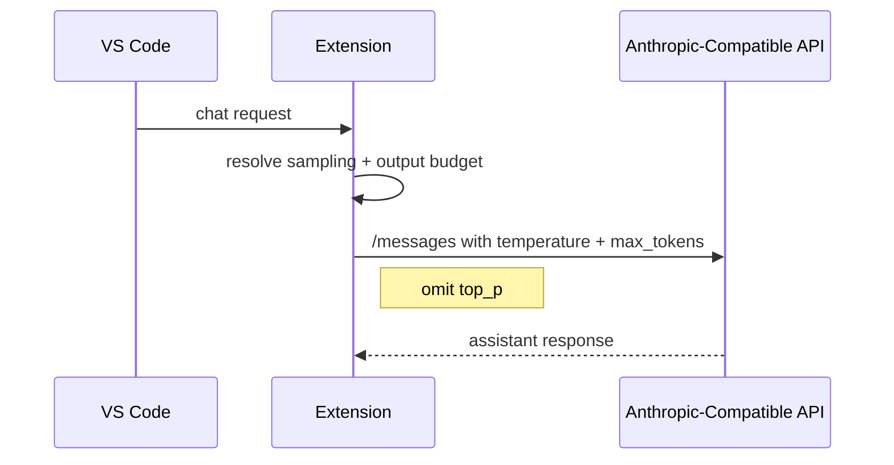

## Anthropic Sampling Compatibility

### Background

| Topic | Detail |
| --- | --- |
| Affected protocol | `anthropic` |
| Failure mode | 上游拒绝同时指定 `temperature` 与 `top_p`，返回 `Invalid request` |
| Compatibility target | 兼容 Anthropic `/messages` 及其兼容端点 |

### Request Design

### Implementation Notes

| Area | Change |
| --- | --- |
| `src/providers/genericProvider.ts` | Anthropic payload 保留 `temperature`，省略 `top_p` |
| `src/test/runTest.ts` | 新增 Anthropic sampling compatibility 回归测试，断言 `top_p` 不出现在 payload 中 |
| `README.md` / `README_en.md` / `DEV.md` | 补充 `topP` 在 `anthropic` 风格下仅作为配置保留、运行时不下发的说明 |
| `package.nls*.json` | 更新配置项文案，避免用户误判 `topP` 会直接传给 Anthropic 风格端点 |
