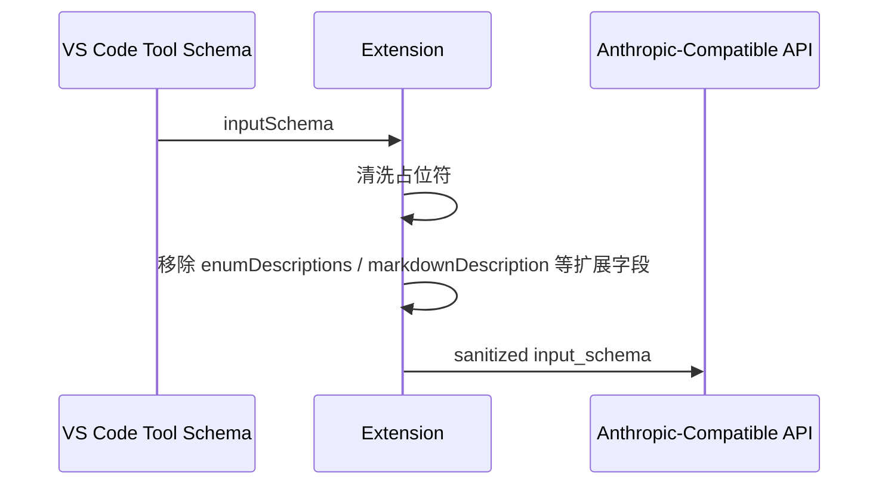

## Anthropic Tool Schema Sanitization

| Item | Value |
| --- | --- |
| Problem | 部分 anthropic 兼容上游会拒绝 VS Code 工具 schema 中的扩展字段，如 `enumDescriptions` |
| Trigger symptom | `Invalid JSON payload received. Unknown name "enumDescriptions"` |
| Scope | 工具 schema 转发链路 |
| Strategy | 转发前递归移除 VS Code / 编辑器专用 schema 字段，同时保留标准 JSON Schema 结构 |

| Changed file | Purpose |
| --- | --- |
| `src/providers/baseProvider.ts` | 在工具 schema 转发前递归剔除非标准编辑器扩展字段 |
| `src/test/runTest.ts` | 增加回归断言，覆盖占位符清洗与 schema 字段剔除 |
| `cases/anthropic-tool-schema-sanitization.md` | 记录可验收场景 |
