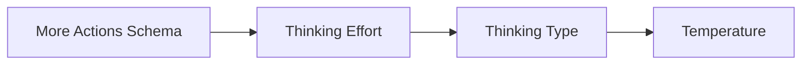

# 模型 More Actions Thinking Type 展示

## 验收用例

| ID | Given | When | Then |
| --- | --- | --- | --- |
| A1 | `openai-chat` 模型支持 `thinkingEffort` 与 `thinkingType` | 打开模型行 `More Actions` 菜单 | 菜单先显示 `Thinking Effort`，随后显示 `Thinking Type`，再显示 `Temperature` |
| A2 | `anthropic` 模型支持 thinking 开关 | 打开模型行 `More Actions` 菜单 | thinking 开关标题显示为 `Thinking Type`，不显示内部字段名 `thinkingType` |

