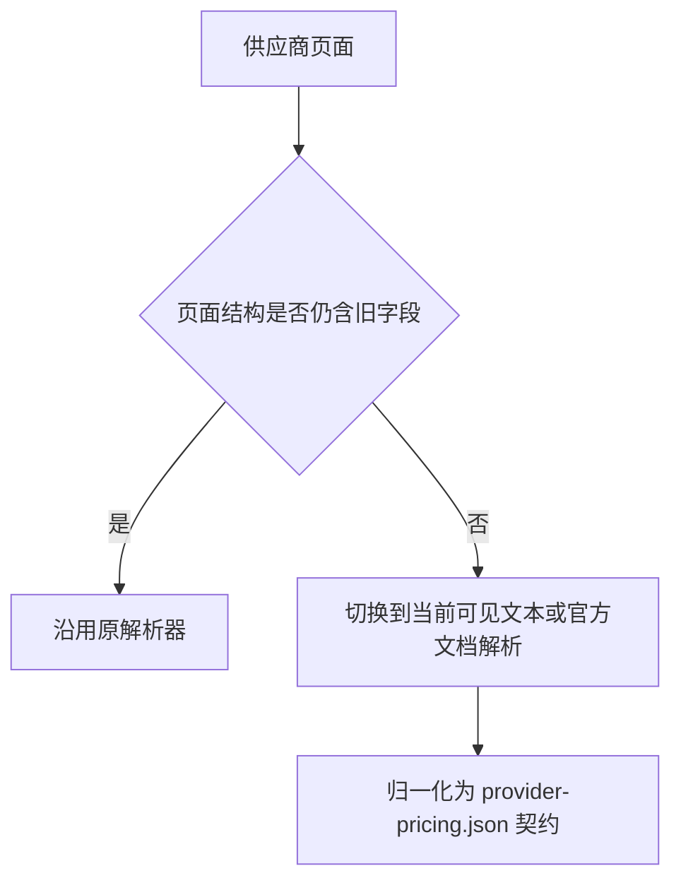

# 套餐页面解析回归用例

## 背景

2026-06-01 供应商页面结构发生变化，导致 `npm run pricing:fetch` 中以下供应商解析失败：

- `jdcloud-ai`
- `chutes-ai`

2026-07-04 腾讯云 Coding Plan 文档页迁移并触发 Playwright fallback 导航超时，导致 `tencent-cloud-ai` 进入旧快照回填。

- `tencent-cloud-ai`

## 解析路径



## 验收用例

### 用例 1：JD Cloud 活动页价格解析

- 前置条件：访问 `https://www.jdcloud.com/cn/pages/codingplan`
- 当：页面展示 `Coding Plan Lite/Pro`、现价 `19.9/99.9`、原价 `40/200`
- 则：
  - 解析结果包含 `Coding Plan Lite`
  - 解析结果包含 `Coding Plan Pro`
  - `currentPriceText` 分别为 `¥19.9/月`、`¥99.9/月`
  - `originalPriceText` 分别为 `¥40/月`、`¥200/月`

### 用例 2：Chutes 首页订阅档位解析

- 前置条件：访问 `https://chutes.ai/`
- 当：首页订阅区仅保留 `Plus`、`Pro` 两个按月套餐，且不再出现 `Base`
- 则：
  - 解析结果不依赖 `Base`
  - 解析结果包含 `Plus:$10/月`
  - 解析结果包含 `Pro:$20/月`
  - `Best Value` 仅挂到 `Pro`

### 用例 3：腾讯云 Coding Plan 文档页 fallback 导航

- 前置条件：访问 `https://cloud.tencent.com/document/product/1823/130092`
- 当：旧文档地址已跳转，且 Playwright 等待 `domcontentloaded` 可能超过 8 秒
- 则：
  - fallback 导航不依赖 `domcontentloaded`
  - 解析等待包含 `Lite 套餐` 与 `Pro 套餐` 的套餐表格
  - 解析结果包含 `Coding Plan Lite`
  - 解析结果包含 `Coding Plan Pro`
  - `provider-pricing.json.failures` 不包含 `tencent-cloud-ai`

## 验证命令

```powershell
node --test tests/scripts/fetch-provider-pricing.test.js
npm run pricing:fetch
npm run serve:page
```
