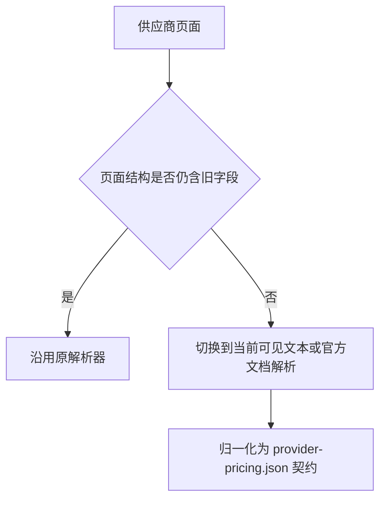

# 套餐页面解析回归用例

## 背景

2026-06-01 供应商页面结构发生变化，导致 `npm run pricing:fetch` 中以下供应商解析失败：

- `jdcloud-ai`
- `chutes-ai`

2026-07-04 腾讯云 Coding Plan 文档页迁移并触发 Playwright fallback 导航超时，导致 `tencent-cloud-ai` 进入旧快照回填。

- `tencent-cloud-ai`

2026-07-14 中文套餐页面结构变化导致以下供应商解析失败：

- `xfyun-ai`：月套餐表包含「无忧版（已下线）」，在售档位名不再满足旧 `版$` 规则，且用量改为请求次数
- `baidu-qianfan-ai`：`codingplan.html` 从 Coding Plan 表格切换为 Token Plan 个人版四档卡片

## 解析路径



## 验收用例

### 用例 1：JD Cloud 活动页价格解析

- 前置条件：访问 `https://www.jdcloud.com/cn/pages/codingplan`
- 当：页面展示 `Coding Plan Lite/Pro`、现价 `19.9/99.9`、原价 `40/200`
- 则：
  - 解析结果包含 `Coding Plan Lite`
  - 解析结果包含 `Coding Plan Pro`
  - `currentPriceText` 分别为 `¥19.9/月`、`¥99.9/月`
  - `originalPriceText` 分别为 `¥40/月`、`¥200/月`

### 用例 2：Chutes 首页订阅档位解析

- 前置条件：访问 `https://chutes.ai/`
- 当：首页订阅区仅保留 `Plus`、`Pro` 两个按月套餐，且不再出现 `Base`
- 则：
  - 解析结果不依赖 `Base`
  - 解析结果包含 `Plus:$10/月`
  - 解析结果包含 `Pro:$20/月`
  - `Best Value` 仅挂到 `Pro`

### 用例 3：腾讯云 Coding Plan 文档页 fallback 导航

- 前置条件：访问 `https://cloud.tencent.com/document/product/1823/130092`
- 当：旧文档地址已跳转，且 Playwright 等待 `domcontentloaded` 可能超过 8 秒
- 则：
  - fallback 导航不依赖 `domcontentloaded`
  - 解析等待包含 `Lite 套餐` 与 `Pro 套餐` 的套餐表格
  - 解析结果包含 `Coding Plan Lite`
  - 解析结果包含 `Coding Plan Pro`
  - `provider-pricing.json.failures` 不包含 `tencent-cloud-ai`

### 用例 4：讯飞星辰 Coding Plan 月套餐解析

- 前置条件：访问 `https://www.xfyun.cn/doc/spark/CodingPlan.html`
- 当：文档同时存在月套餐表、季套餐表，且包含「无忧版（已下线）」
- 则：
  - 仅解析月套餐在售档位
  - 解析结果包含 `Astron Coding Plan 专业版` / `¥39/月`
  - 解析结果包含 `Astron Coding Plan 高效版` / `¥199/月`
  - 不包含已下线档位与季套餐价格
  - `provider-pricing.json.failures` 不包含 `xfyun-ai`

### 用例 5：百度千帆 Token Plan 个人版卡片解析

- 前置条件：访问 `https://cloud.baidu.com/product/codingplan.html`
- 当：页面展示 Mini/Lite/Pro/Max 四档 Token Plan 卡片，现价分别为 `4.9/19.9/99.9/299.9`
- 则：
  - 解析结果包含 `Token Plan Mini` / `¥4.9/月`（原价 `¥9.9/月`）
  - 解析结果包含 `Token Plan Lite` / `¥19.9/月`（原价 `¥40/月`）
  - 解析结果包含 `Token Plan Pro` / `¥99.9/月`（原价 `¥200/月`）
  - 解析结果包含 `Token Plan Max` / `¥299.9/月`（原价 `¥600/月`）
  - `provider-pricing.json.failures` 不包含 `baidu-qianfan-ai`

## 验证命令

```powershell
node --test tests/scripts/fetch-provider-pricing.test.js
npm run pricing:fetch
npm run serve:page
```
