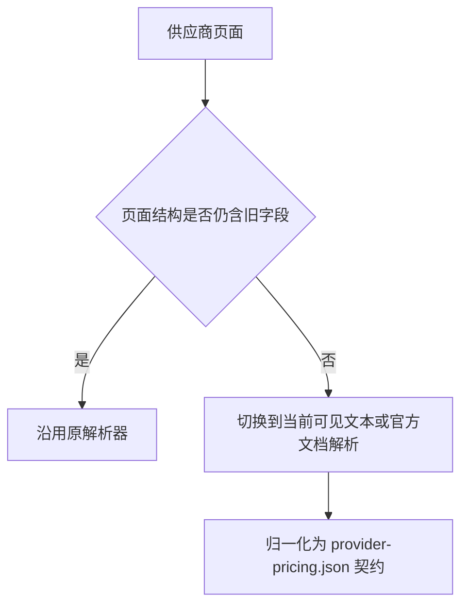
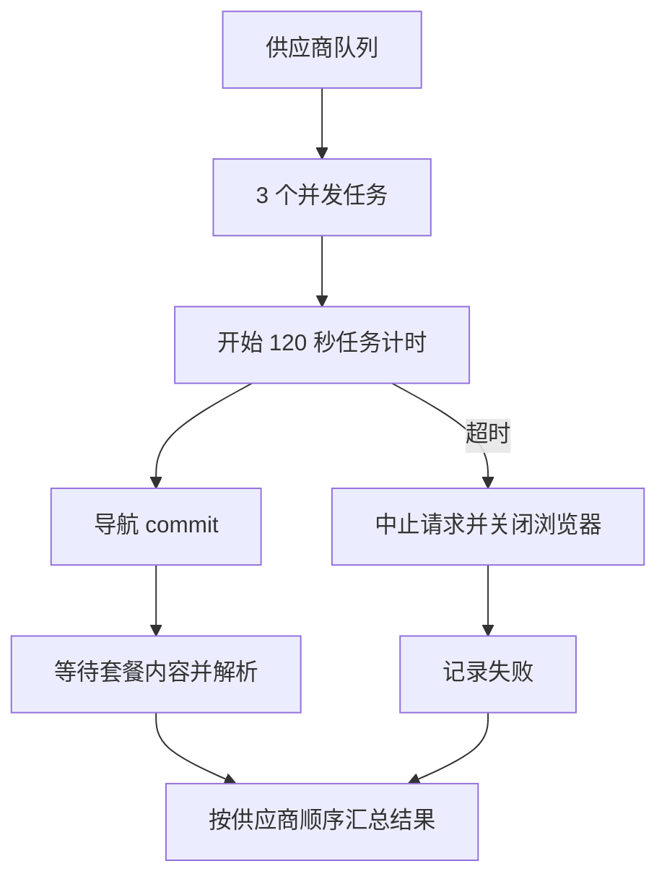

# 套餐页面解析回归用例

## 背景

2026-06-01 供应商页面结构发生变化，导致 `npm run pricing:fetch` 中以下供应商解析失败：

- `jdcloud-ai`
- `chutes-ai`

2026-07-04 腾讯云 Coding Plan 文档页迁移并触发 Playwright fallback 导航超时，导致 `tencent-cloud-ai` 进入旧快照回填。

- `tencent-cloud-ai`

2026-07-14 中文套餐页面结构变化导致以下供应商解析失败：

- `xfyun-ai`：月套餐表包含「无忧版（已下线）」，在售档位名不再满足旧 `版$` 规则，且用量改为请求次数
- `baidu-qianfan-ai`：`codingplan.html` 从 Coding Plan 表格切换为 Token Plan 个人版四档卡片

2026-08-20 Kimi 大陆帮助页改为 Next.js SSR，旧 `/zh-cn/help/` 地址会 301，且 Playwright `domcontentloaded` + 文案等待会超过 30 秒任务上限：

- `kimi-ai`：`Task timed out after 30000ms`

## 解析路径


```mermaid
flowchart TD
  A[供应商页面] --> B{页面结构是否仍含旧字段}
  B -- 是 --> C[沿用原解析器]
  B -- 否 --> D[切换到当前可见文本或官方文档解析]
  D --> E[归一化为 provider-pricing.json 契约]
```

## 验收用例

### 2026-09-07：中文套餐抓取超时与智谱宣传文案变化

- 前置条件：抓取全部 26 家供应商，部分页面导航和渲染合计超过 30 秒。
- 当：运行 `npm run pricing:fetch`。
- 则：最多同时执行 3 家；每家开始执行后计时 120 秒，排队时间不计入预算；结果仍与供应商对应，单家失败不阻止后续任务。
- 当：页面已提交导航且套餐内容已就绪，但无关资源仍未完成加载。
- 则：有内容等待条件的渲染抓取不依赖 `domcontentloaded`；通用导航和腾讯文档导航允许等待 30 秒，供应商显式覆盖除外。
- 当：智谱首页改为「GLM Coding Plan / 你的全能搭档」，三张 `.cp-card` 已显示价格。
- 则：不再等待旧宣传语；切换「连续包月」并确认激活后才提取价格；两个 `waitForFunction` 的超时分别通过第三参数指定为 20 秒、10 秒。
- 当：任务超过总预算。
- 则：终止其 HTTP 请求、关闭已启动的浏览器，不允许后续备用解析路径启动新浏览器；启动中才超时的浏览器也须关闭。
- 当：联通云浏览器及既有 HTML 抓取路径均失败。
- 则：失败记录同时包含两条路径的错误，不只显示 `fetch failed`。
- 线上验收：智谱、腾讯云、京东云、摩尔线程、阶跃星辰、联通云均产生新抓取结果，无 `stale` 标记；本机通过不等同于 GitHub runner 网络验证。


```mermaid
flowchart TD
  Q[供应商队列] --> W[3 个并发任务]
  W --> T[开始 120 秒任务计时]
  T --> N[导航 commit]
  N --> P[等待套餐内容并解析]
  P --> R[按供应商顺序汇总结果]
  T -->|超时| C[中止请求并关闭浏览器]
  C --> F[记录失败]
  F --> R
```

自动回归：`node --test tests/scripts/pricing-execution.test.js tests/scripts/fetch-provider-pricing.test.js`。

### 用例 1：JD Cloud 活动页价格解析

- 前置条件：访问 `https://www.jdcloud.com/cn/pages/codingplan`
- 当：页面展示 `Coding Plan Lite/Pro`、现价 `19.9/99.9`、原价 `40/200`
- 则：
  - 解析结果包含 `Coding Plan Lite`
  - 解析结果包含 `Coding Plan Pro`
  - `currentPriceText` 分别为 `¥19.9/月`、`¥99.9/月`
  - `originalPriceText` 分别为 `¥40/月`、`¥200/月`

### 用例 2：Chutes 首页订阅档位解析

- 前置条件：访问 `https://chutes.ai/`
- 当：首页订阅区仅保留 `Plus`、`Pro` 两个按月套餐，且不再出现 `Base`
- 则：
  - 解析结果不依赖 `Base`
  - 解析结果包含 `Plus:$10/月`
  - 解析结果包含 `Pro:$20/月`
  - `Best Value` 仅挂到 `Pro`

### 用例 3：腾讯云 Coding Plan 文档页 fallback 导航

- 前置条件：访问 `https://cloud.tencent.com/document/product/1823/130092`
- 当：旧文档地址已跳转，且 Playwright 等待 `domcontentloaded` 可能超过 8 秒
- 则：
  - fallback 导航不依赖 `domcontentloaded`
  - 解析等待包含 `Lite 套餐` 与 `Pro 套餐` 的套餐表格
  - 解析结果包含 `Coding Plan Lite`
  - 解析结果包含 `Coding Plan Pro`
  - `provider-pricing.json.failures` 不包含 `tencent-cloud-ai`

### 用例 4：讯飞星辰 Coding Plan 月套餐解析

- 前置条件：访问 `https://www.xfyun.cn/doc/spark/CodingPlan.html`
- 当：文档同时存在月套餐表、季套餐表，且包含「无忧版（已下线）」
- 则：
  - 仅解析月套餐在售档位
  - 解析结果包含 `Astron Coding Plan 专业版` / `¥39/月`
  - 解析结果包含 `Astron Coding Plan 高效版` / `¥199/月`
  - 不包含已下线档位与季套餐价格
  - `provider-pricing.json.failures` 不包含 `xfyun-ai`

### 用例 5：百度千帆 Token Plan 个人版卡片解析

- 前置条件：访问 `https://cloud.baidu.com/product/codingplan.html`
- 当：页面展示 Mini/Lite/Pro/Max 四档 Token Plan 卡片，现价分别为 `4.9/19.9/99.9/299.9`
- 则：
  - 解析结果包含 `Token Plan Mini` / `¥4.9/月`（原价 `¥9.9/月`）
  - 解析结果包含 `Token Plan Lite` / `¥19.9/月`（原价 `¥40/月`）
  - 解析结果包含 `Token Plan Pro` / `¥99.9/月`（原价 `¥200/月`）
  - 解析结果包含 `Token Plan Max` / `¥299.9/月`（原价 `¥600/月`）
  - `provider-pricing.json.failures` 不包含 `baidu-qianfan-ai`

### 用例 6：Kimi 大陆帮助页 SSR HTML 解析

- 前置条件：访问 `https://www.kimi.com/help/membership/membership-pricing`
- 当：页面为压缩 SSR HTML，表格仅保留 Andante/Moderato/Allegretto/Allegro 四档，且不再展示 Adagio
- 则：
  - 不启动 Playwright，不依赖 `document.body.innerText` 换行
  - 从 HTML 块级标签还原可见文本后解析
  - 解析结果包含 `Andante（大陆）` / `¥49/月`
  - 解析结果包含 `Moderato（大陆）` / `¥99/月`
  - 解析结果包含 `Allegretto（大陆）` / `¥199/月`
  - 解析结果包含 `Allegro（大陆）` / `¥699/月`
  - 不包含 `Adagio`
  - 单供应商抓取在 30 秒任务上限内完成
  - `provider-pricing.json.failures` 不包含 `kimi-ai`

## 验证命令

```powershell
node --test tests/scripts/fetch-provider-pricing.test.js
npm run pricing:fetch
npm run serve:page
```
