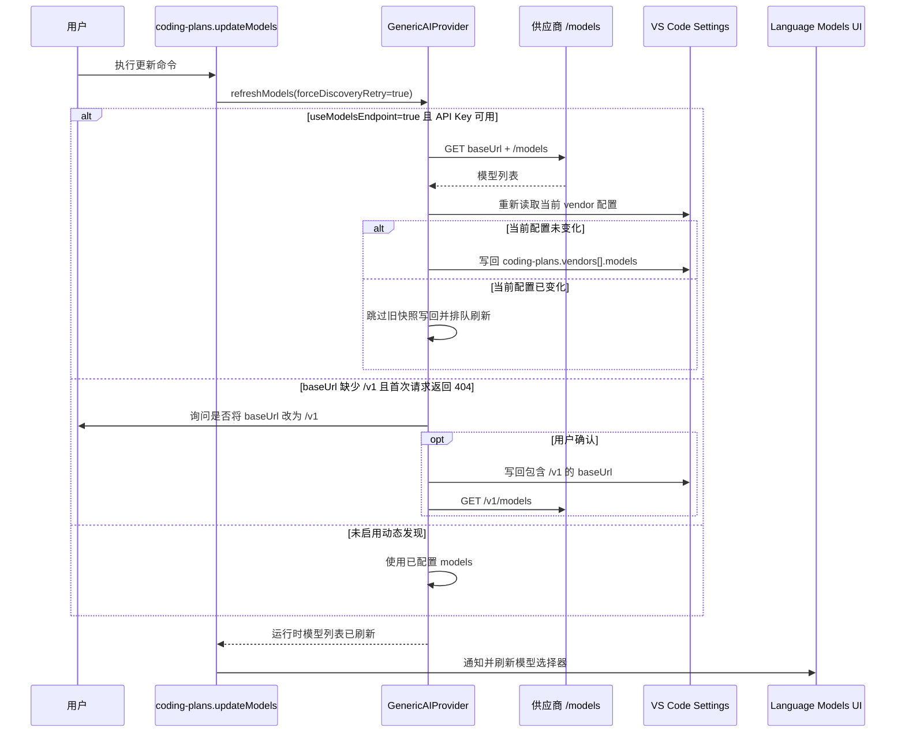

# 更新 models 列表命令验收用例

## 背景

用户需要从命令面板主动执行一次模型列表更新，并在供应商启用 `useModelsEndpoint` 时，将 `baseUrl + /models` 的发现结果写回 `coding-plans.vendors[].models`。

## 验收用例

| 场景 | 前置条件 | 操作 | 预期结果 |
| --- | --- | --- | --- |
| 命令可发现 | 扩展已激活 | 打开命令面板搜索 `Update Coding Plans Models List` | 可看到并执行 `coding-plans.updateModels` 命令。 |
| 更新 models 配置 | 供应商配置了 `baseUrl`、API Key 且 `useModelsEndpoint=true` | 执行 `Coding Plans: Update Coding Plans Models List` | 扩展请求规范化后的 `baseUrl + /models`，将发现到的模型写回 `coding-plans.vendors[].models`，并保留已有模型的手工覆盖项。 |
| 删除模型后不自动补回 | 供应商配置了 `useModelsEndpoint=true` 且 `/models` 仍返回被删除的模型 | 用户从 settings 删除某个 `models[]` 项并保存配置 | 配置变更监听只刷新运行时 settings 模型，不应请求 `/models`，不应写回 `models[]`；只有手动执行刷新命令时才会补回并使用 models.dev 新结构。 |
| 配置变更期间写回 | `/models` 刷新尚未完成时，用户删除或修改同一供应商的模型配置 | 刷新返回后准备自动写回 | 本轮旧快照写回应被跳过，并排队使用最新配置重新发现；不应先写入旧模型结构再写入新结构。 |
| models.dev 元数据 | 本地供应商 `name` 与 models.dev provider 名不一致 | 自动发现新模型并匹配 models.dev | 本地供应商名不参与 provider 匹配；价格按所有匹配模型来源取中位数，模型协议仅按模型自身来源推导。 |
| 旧 fallback 升级 | settings 中已有扩展自动生成的旧结构，如 `cliproxyapi model: gemini-3-flash-preview` | `/models` 返回同名模型且 models.dev 可匹配 | 该项应替换为 models.dev 新结构并保留 `enabled`，而不是继续保留旧 fallback 描述、旧上下文和缺失的 `price/thinking`。 |
| `/v1/models` 地址 | 供应商模型接口实际位于 `/v1/models` | 将 `baseUrl` 配置为包含 `/v1` 的地址，或在 404 补 `/v1` 弹窗中确认 | 扩展请求 `/v1/models`；未配置 `/v1` 且未确认弹窗时，不应静默改写 baseUrl。 |
| 同步模型选择器 | `/models` 返回的模型集发生变化 | 命令执行完成 | 扩展触发 provider 模型变化通知，并同步 VS Code Language Models UI。 |
| 无动态端点 | 供应商 `useModelsEndpoint=false` | 执行命令 | 扩展仅使用当前配置模型刷新运行时列表，不引入隐式发现逻辑。 |

## 流程

