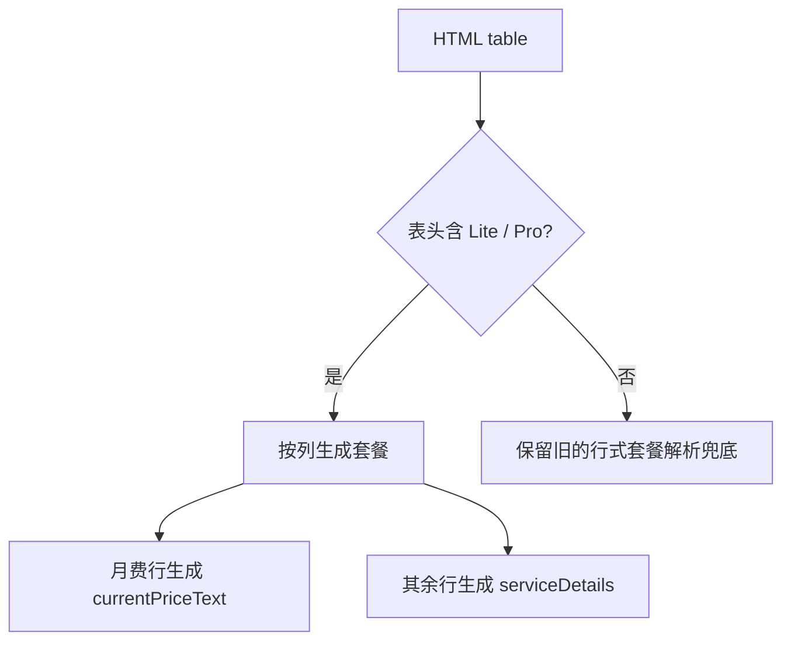

# 优云智算套餐解析说明

| 模块 | 说明 |
| --- | --- |
| `scripts/fetch-provider-pricing.js` | `parseCompshareCodingPlansFromHtml` 识别优云智算文档里的套餐对比表 |
| `assets/provider-pricing.json` | 写入 `compshare-ai` 的 Lite / Pro 月付套餐 |
| `pages/app.js` | 继续按 `plans[].serviceDetails` 渲染服务内容，无需页面特殊分支 |

| 字段 | 来源 | 示例 |
| --- | --- | --- |
| `name` | 表头套餐列 | `Lite 基础版` |
| `currentPriceText` | `月费` 行对应列 | `¥49/月` |
| `serviceDetails` | 除表头和月费外的同列单元格 | `调用次数 / 5小时: 约 600 次` |

优云智算页面的对比表是“列为套餐、行为指标”。旧逻辑按“第一列套餐名、第二列价格”读取，导致 `月费` 被当成套餐名，`¥199/月` 被塞进 Lite 的服务内容。新逻辑优先识别列式对比表，并保留旧行式解析作为兜底。
