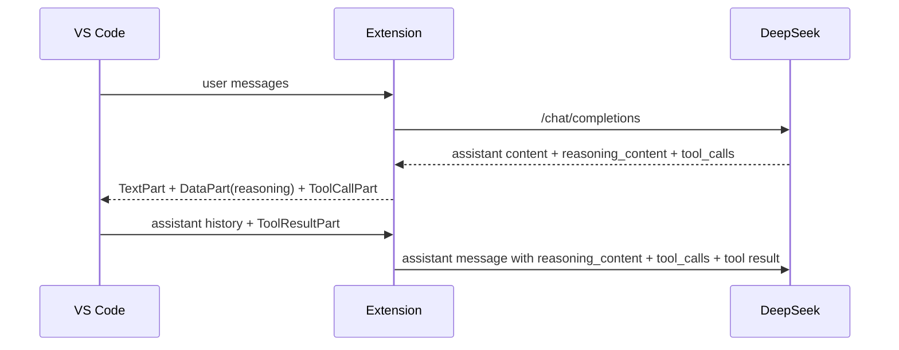

## DeepSeek Thinking Mode Round-Trip

### Background

| Topic | Detail |
| --- | --- |
| Affected protocol | `openai-chat` |
| Affected model shape | DeepSeek thinking mode responses that include `reasoning_content` |
| Failure mode | 工具调用后的下一次请求未回传 `reasoning_content`，上游返回 `400 invalid_request_error` |

### Current Design

### Implementation Notes

| Area | Change |
| --- | --- |
| `src/providers/baseProvider.ts` | 新增内部 `LanguageModelDataPart` MIME 类型，用于隐藏携带 `reasoning_content` |
| `src/providers/baseProvider.ts` | 在 `toProviderMessages()` 中识别 reasoning DataPart，并恢复到 assistant `reasoning_content` 字段 |
| `src/providers/genericProvider.ts` | 增加基于 `tool_call_id` 的本地 reasoning cache，兜底 VS Code 未回传隐藏 DataPart 的场景 |
| `src/providers/genericProviderProtocols.ts` | 区分可见 `content` 与隐藏 `reasoningContent`，避免 tool-call-only 响应把思考文本当正文输出 |
| `src/providers/genericProvider.ts` | OpenAI chat 流式/非流式路径都把 `reasoning_content` 放回 response parts，并在续轮请求中原样透传 |
| `src/test/runTest.ts` | 补充 DeepSeek thinking + tool continuation 回归测试 |
