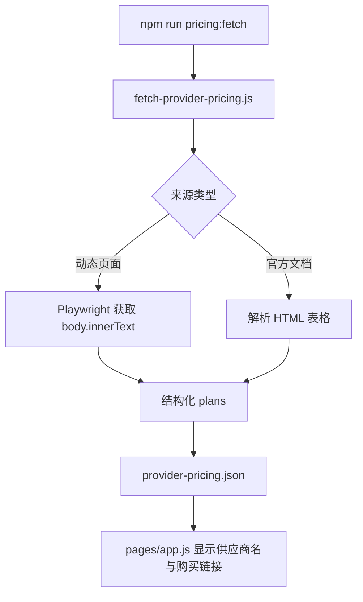

# 新增 Coding / Token Plan 供应商解析说明

| Provider ID | 来源 | 解析方式 | 价格口径 |
| --- | --- | --- | --- |
| `mthreads-coding-plan` | `https://code.mthreads.com/` | Playwright 读取页面正文 | 季度价折算为月等效价，原始季度价写入说明 |
| `stepfun-step-plan` | `https://platform.stepfun.com/step-plan?channel=step-dev` | Playwright 读取套餐卡片正文 | 月付限时优惠价，保留原价 |
| `cucloud-coding-plan` | `https://www.cucloud.cn/activity/kickoffseason.html` | Playwright 读取活动页正文 | 免费活动名额 |
| `scnet-coding-plan` | `https://www.scnet.cn/ac/openapi/doc/2.0/moduleapi/codingplan/subscriptionnotice.html` | 官方 VitePress 文档 HTML 表格 | 人民币月付 |
| `cerebras-code` | Cerebras 官方博客 | Playwright 读取正文 | 美元月付 |
| `synthetic-ai` | Synthetic pricing | Playwright 读取 pricing 页正文 | 美元月付 Subscription Pack |
| `chutes-ai` | Chutes 首页 pricing 区 | Playwright 读取 pricing 区正文 | 美元月付订阅 |
| `kilo-pass` | Kilo Pass 页面 | Playwright 读取页面正文 | 美元月付 credits 订阅 |

| 注意事项 | 说明 |
| --- | --- |
| 非月付套餐 | 看板默认过滤非月付价格，因此摩尔线程季度价按月等效价展示，原始季度价保留在 `notes` |
| 活动型套餐 | 联通云免费名额属于活动信息，不代表长期公开售卖价 |
| SCNet 来源 | 价格与额度来自官方订阅须知文档，控制台购买入口仅作为跳转链接保留 |
