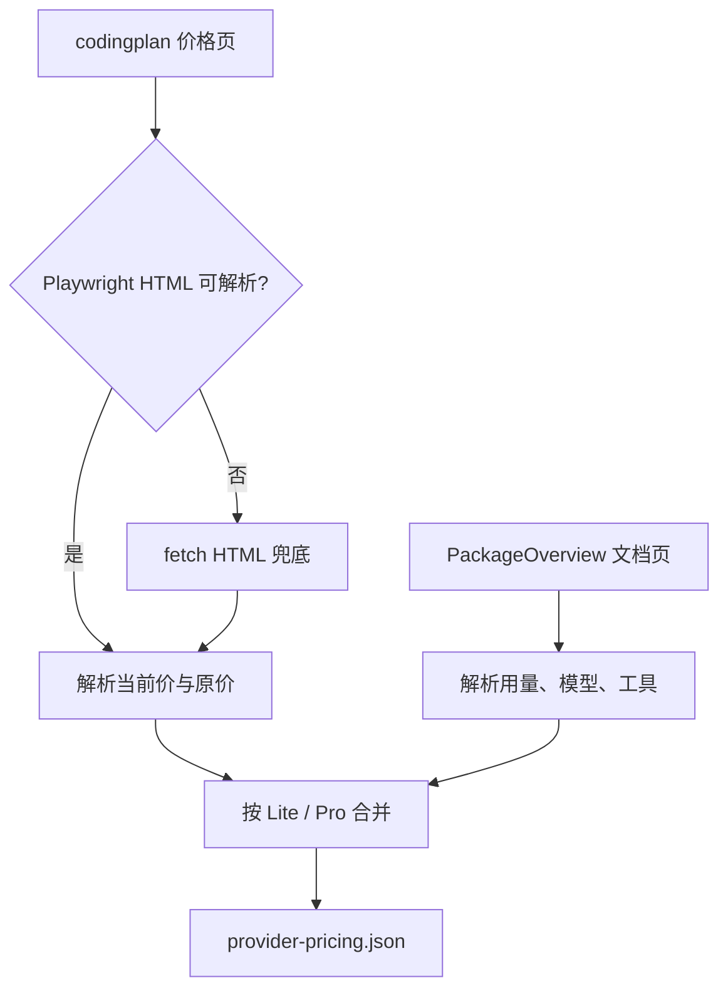

# 京东云 Coding Plan 价格页解析说明

| 模块 | 说明 |
| --- | --- |
| `scripts/fetch-provider-pricing.js` | `parseJdCloudCodingPlans` 优先用 Playwright 渲染 `codingplan` 价格页解析 Lite / Pro 价格，再用 `PackageOverview` 补充套餐详情 |
| `assets/provider-pricing.json` | 写入 `jdcloud-ai` 的 `Coding Plan Lite` 与 `Coding Plan Pro` 价格、原价、用量和模型工具说明 |
| `pages/app.js` | `jdcloud-ai` 默认入口指向京东云 Coding Plan 价格页 |

| 字段 | 来源 | 示例 |
| --- | --- | --- |
| `name` | 价格页套餐标题 | `Coding Plan Lite` |
| `currentPriceText` | 价格页当前价 | `¥19.9/月` |
| `originalPriceText` | 价格页原价 | `¥40/月` |
| `unit` | 价格页订阅周期 | `月` |
| `serviceDetails` | 文档页套餐用量说明、模型自由切换、兼容工具，合并价格页权益说明 | `用量限制：每5小时：最多约 1,200 次请求。...` |

京东云价格字段来自官方 `codingplan` 页面；`PackageOverview` 文档页提供更完整的适用人群、用量限制、支持模型和兼容工具说明。价格页解析失败时，脚本仍可回退到文档页输出可展示的套餐详情。
