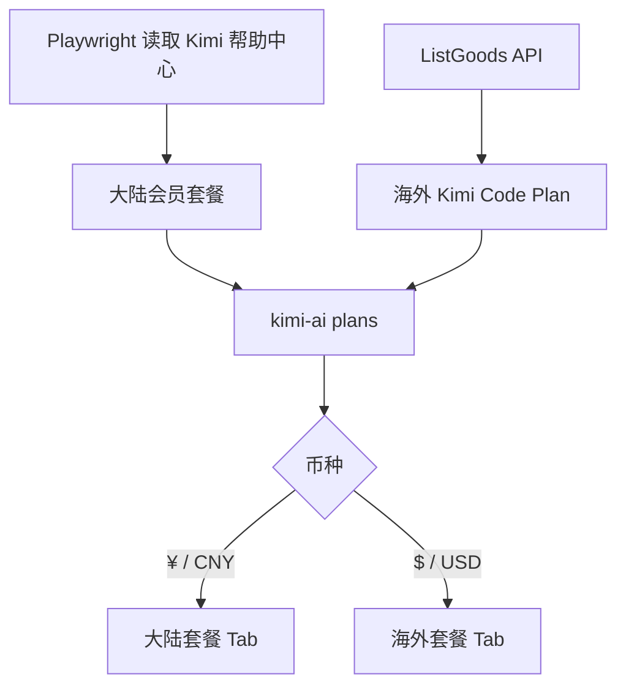

# Moonshot Kimi 海内外套餐抓取说明

| 文件 | 说明 |
| --- | --- |
| `scripts/fetch-provider-pricing.js` | 合并 Moonshot Kimi 大陆会员价格与海外 Kimi Code Plan |
| `assets/provider-pricing.json` | 输出 `kimi-ai` 的人民币与美元套餐 |
| `assets/openrouter-provider-plans.json` | 通过 `provider-pricing` 结构化数据同步到 OpenRouter provider 套餐 |
| `pages/app.js` | 按币种拆分大陆/海外 Tab，并为 Kimi 选择对应购买入口 |

| 来源 | URL | 币种 | 解析重点 |
| --- | --- | --- | --- |
| 大陆会员价格 | `https://www.kimi.com/zh-cn/help/membership/membership-pricing` | 人民币（CNY） | 使用 Playwright 获取页面正文，解析连续包月价格与 Kimi Code 权益 |
| 海外 Kimi Code Plan | `https://www.kimi.com/apiv2/kimi.gateway.order.v1.GoodsService/ListGoods` | 美元（USD） | 读取 `amounts[].currency` 与 `priceInCents`，只保留月付套餐 |

| 输出约定 | 说明 |
| --- | --- |
| `plans[].name` | 增加 `（大陆）` 或 `（海外）` 后缀，避免同名档位混淆 |
| `plans[].currentPriceText` | 大陆保留 `¥`，海外保留 `$` |
| `plans[].serviceDetails` | 第一项写入 `计价币种: 人民币（CNY）` 或 `计价币种: 美元（USD）` |
| 页面购买入口 | 大陆 Kimi 指向帮助中心价格页，海外 Kimi 指向 `https://www.kimi.com/code` |

