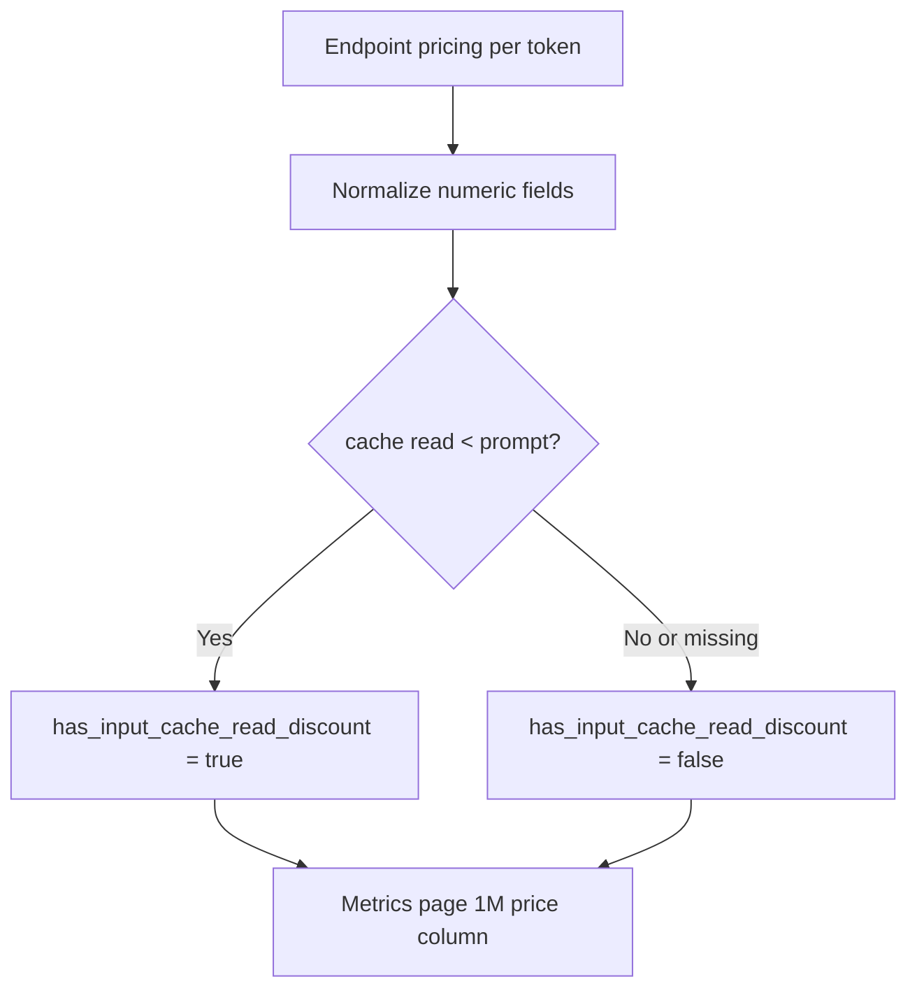

# OpenRouter Provider 指标价格列实现说明

| 文件 | 说明 |
| --- | --- |
| `scripts/fetch-openrouter-provider-metrics.js` | 从 `/models/{author}/{slug}/endpoints` 读取 endpoint pricing 并规范化 |
| `assets/openrouter-provider-metrics.json` | 在 `models[].endpoints[].pricing` 保存页面所需价格字段 |
| `pages/app.js` | 将每 token 价格折算为每 1M token 人民币价格并渲染 |
| `pages/styles.css` | 控制价格列的紧凑三行布局 |

## 数据契约

| 字段 | 含义 | 备注 |
| --- | --- | --- |
| `pricing.prompt` | 普通输入 token 单价 | OpenRouter 原始每 token 美元价格 |
| `pricing.input_cache_read` | 输入缓存命中 token 单价 | 缺失、为 `0`、或不低于输入价时不展示“缓存命中”行 |
| `pricing.input_cache_write` | 写入缓存 token 单价 | 暂不展示，保留给后续扩展 |
| `pricing.completion` | 输出 token 单价 | OpenRouter 原始每 token 美元价格 |
| `pricing.has_input_cache_read_discount` | 缓存命中正数价格是否低于普通输入价格 | 由脚本计算，页面用于显示“缓存命中”行与“缓存折扣”标记 |
| `pricing.input_cache_read_discount_rate` | 缓存命中折扣率 | `1 - input_cache_read / prompt`，页面显示在“缓存折扣”标签内 |
| `pricing.cny.*` | 基于抓取时 USD/CNY 汇率计算的人民币 token 单价 | 页面展示每 1M token 人民币估算 |
| `exchangeRates.USD_CNY` | 抓取时使用的美元人民币汇率快照 | 可通过 `USD_CNY_EXCHANGE_RATE` 环境变量覆盖 |

页面展示单位固定为人民币 / 1M token：

| 页面行 | 计算 |
| --- | --- |
| 输入 | `pricing.prompt * 1_000_000` |
| 缓存命中 | 仅当 `pricing.has_input_cache_read_discount` 为 `true` 时展示，计算 `pricing.input_cache_read * 1_000_000` |
| 输出 | `pricing.completion * 1_000_000` |

价格列表头 `1M价格(入/缓存/出)` 的排序口径：

| Endpoint 类型 | 排序值 |
| --- | --- |
| 有缓存命中优惠价 | `pricing.input_cache_read` |
| 无缓存命中优惠价 | `pricing.prompt` |

## 费用提示

| 项目 | 说明 |
| --- | --- |
| 平台手续费 | OpenRouter 结算可能叠加自己的平台手续费 |
| 支付手续费 | 信用卡、充值渠道或支付服务可能继续收取手续费 |
| 页面口径 | 看板价格只用于 provider endpoint 单价对比，实际支付以 OpenRouter 结算页为准 |

## URL 筛选参数

| 参数 | 对应筛选 |
| --- | --- |
| `metricsOrg` | 模型厂商，例如 `deepseek` |
| `metricsModel` | 模型 id，例如 `deepseek/deepseek-v4-pro` |
| `metricsProvider` | Provider 显示名，例如 `DeepSeek` |
| `metricsCacheDiscount` | 缓存优惠，`yes` 或 `no` |

多个值用英文逗号分隔；`all` 或缺省表示全部。示例：

`/?metricsOrg=deepseek&metricsModel=deepseek%2Fdeepseek-v4-pro&metricsCacheDiscount=yes#metrics`
