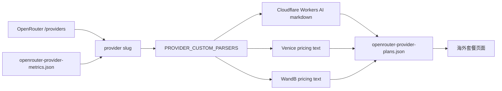

# OpenRouter Provider 套餐详情抓取说明

| 文件 | 说明 |
| --- | --- |
| `scripts/fetch-openrouter-provider-plans.js` | 负责从 OpenRouter provider 元数据、国内结构化套餐、官方价格页合并海外套餐数据 |
| `assets/openrouter-provider-plans.json` | 页面消费的海外 provider 套餐产物 |
| `pages/app.js` | 读取 `plans[].serviceDetails` 并渲染为“服务内容”列表 |
| `tests/pages/github-pages.spec.ts` | 验证海外页中 Venice、WandB、Cloudflare 的服务详情 |

| Provider | 抓取策略 | 关键原因 |
| --- | --- | --- |
| Cloudflare | 使用 `https://developers.cloudflare.com/workers-ai/platform/pricing/index.md` | `https://www.cloudflare.com/plans/` 是通用 Cloudflare 套餐页，容易抓到非 LLM 价格 |
| Venice | 从 `https://venice.ai/pricing` 的套餐文本提取 Pro / Pro Plus / Max | 通用价格启发式能抓到价格，但无法稳定绑定服务详情 |
| WandB | 从 `https://site.wandb.ai/pricing/` 提取 Pro 与 Inference add-on | Inference 价格在对比表中，需补充 AI app / inference 相关服务说明 |

| 输出字段 | 约定 |
| --- | --- |
| `plans[].name` | 使用官网套餐名或明确的 add-on 名称 |
| `plans[].currentPriceText` | 保留官网可读价格文本 |
| `plans[].serviceDetails` | 必须是可直接展示的字符串数组；Cloudflare 应优先包含 Neurons 与 LLM token pricing |
| `pricingPageUrl` | 指向最贴近套餐含义的官方价格页 |
