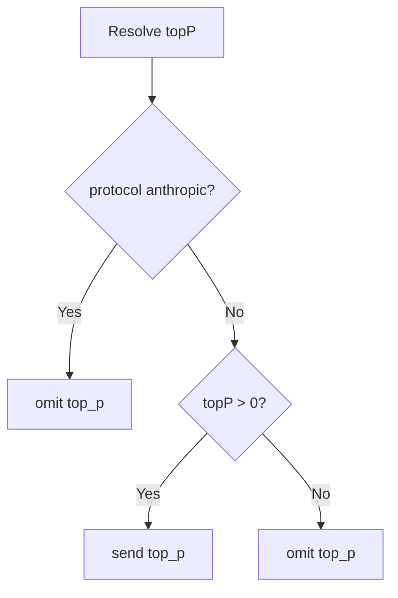

## Top-P Zero Omit Request

### Background

| Topic | Detail |
| --- | --- |
| Affected protocols | `openai-chat`, `openai-responses`, `anthropic` |
| New runtime default | `DEFAULT_TOP_P = 0` |
| Compatibility rule | 当解析后的 `topP = 0` 时，不在请求体中发送 `top_p` |

### Request Rule

### Implementation Notes

| Area | Change |
| --- | --- |
| `src/constants.ts` | 将 `DEFAULT_TOP_P` 从 `1.0` 调整为 `0` |
| `src/providers/genericProvider.ts` | `openai-chat` 与 `openai-responses` 仅在 `topP > 0` 时拼接 `top_p` |
| `src/test/runTest.ts` | 增加默认省略、正数发送、模型 `0` 覆盖供应商默认值、`openai-responses` 省略/发送等回归测试 |
| `README*` / `DEV.md` / `package.nls*` | 同步更新默认值与 `0 = omit top_p` 的说明 |
